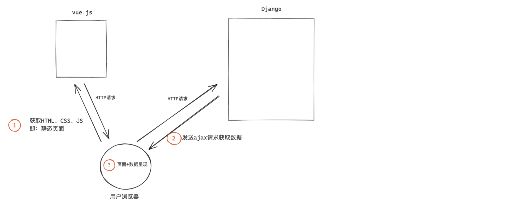
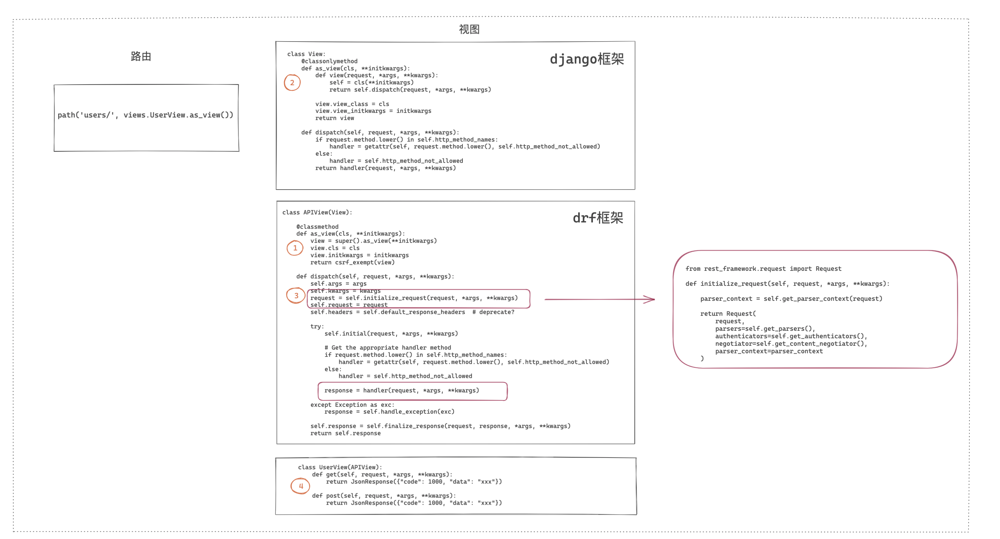
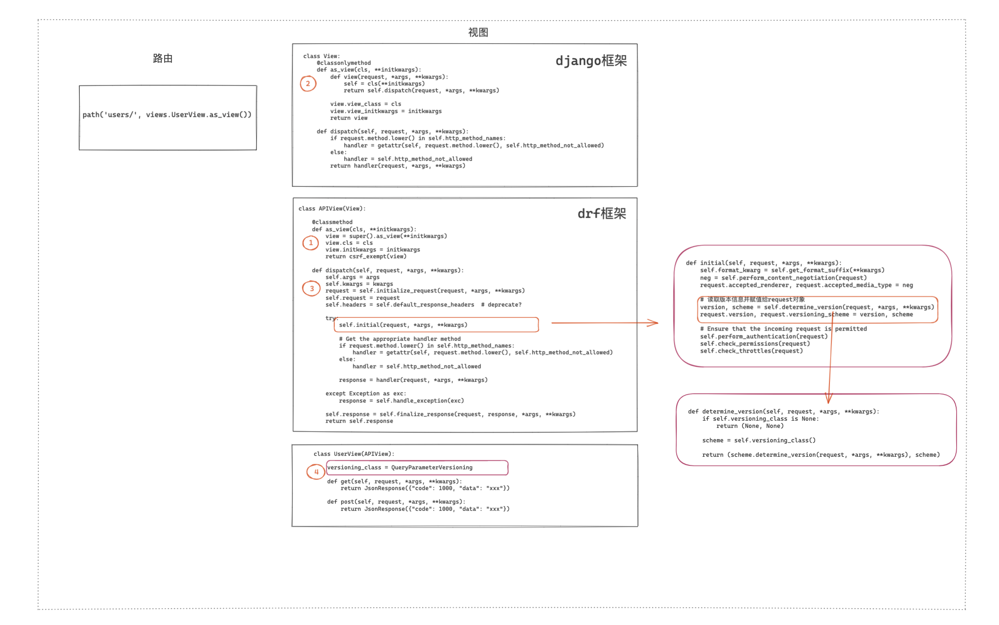
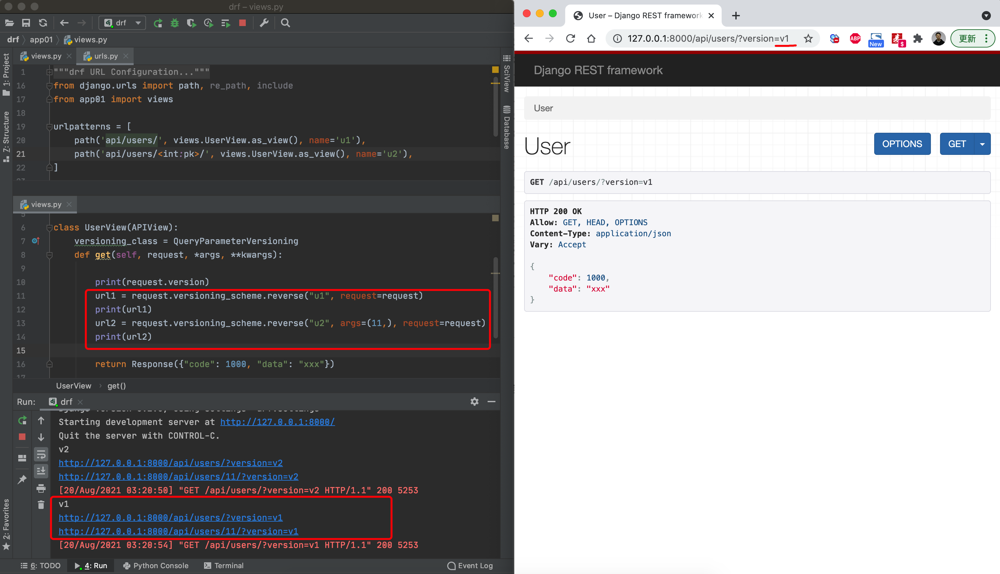

# drf认证，权限，限流，版本

## 1.前后端分离




## 2.FBV和CBV

- FBV，function base views，其实就是编写函数来处理业务请求。

  ```python
  from django.urls import path
  from app01 import views
  urlpatterns = [
      path('users/', views.users),
  ]
  ```
  
  ```python
  from django.http import JsonResponse
  
  def users(request, *args, **kwargs):
      if request.method == "GET":
          return JsonResponse({"code":1000,"data":"xxx"})
      elif request.method == 'POST':
          return JsonResponse({"code":1000,"data":"xxx"})
      ...
  ```
  
- CBV，class base views，其实就是编写类来处理业务请求。

  ```python
  from django.urls import path
  from app01 import views
  urlpatterns = [
      path('users/', views.UserView.as_view()),
  ]
  ```
  
  ```python
  from django.views import View
  
  class UserView(View):
      def get(self, request, *args, **kwargs):
          return JsonResponse({"code": 1000, "data": "xxx"})
  
      def post(self, request, *args, **kwargs):
          return JsonResponse({"code": 1000, "data": "xxx"})
  ```

CBV可以通过`GET`和`POST`轻松区分两种方法，其实CBV和FBV的底层实现本质上相同的。

前后端不分离项目常见用FBV

DRF项目两种模式都支持，常见使用CBV


## 3.drf

django restframework框架是在django的基础上又给我们提供了很多方便的功能，让我们可以更便捷基于django开发restful API

drf组件总流程：版本 -> 认证 -> 权限 -> 限流


### 3.1 drf项目


```
pip install django
pip install djangorestframework
```


#### 3.1.1 核心配置

```python
INSTALLED_APPS = [
    'django.contrib.admin',
    'django.contrib.auth',
    'django.contrib.contenttypes',
    'django.contrib.sessions',
    'django.contrib.messages',
    'django.contrib.staticfiles',
    "app01.apps.App01Config",
    'rest_framework',
]
```


#### 3.1.2 路由

```python
from django.urls import path
from api import views

urlpatterns = [
    path('users/', views.UserView.as_view()),
]
```


#### 3.1.3 视图

```python
from rest_framework.views import APIView
from rest_framework.response import Response


class UserView(APIView):
    def get(self, request):
        return Response("...")
```


#### 3.1.4 drf请求入口分析


### 3.2 request和参数

drf中的request和django中的request不一样，实际上是对django的request参数进行再封装


可以看到，在Django中request是`WSGIRequest`对象；而在drf中的request是`rest_framework.request.Request`对象

#### 3.2.1 参数

- 普通路由通过`self.kwargs`可以拿到请求的路由中传递的参数

  

- 含正则表达式的路由通过`self.args`拿到路由中传递的参数

  

#### 3.2.2 request对象

##### 1.源码分析

在路由入口`dispatch`中，有一个函数`initialize_request(request, *args, **kwargs)`


再来看函数`initialize_request(request, *args, **kwargs)`具体干了些啥

这个函数将原来的Django中的request当作参数传入，返回的其实也是一个`Request`对象


而在`Request`对象源码中，将本来的Django的`request`赋值为`_request`


同时在源码中，有一个`__getattr__`方法，这个方法的作用是，如果我访问了类中一个不存在的变量时，就会执行这个`__getattr__`方法，并返回


也就是说，我可以通过request._request.xxx获取到原本django中的request对象里面的值，

也可以通过request.xxx同时获取到drf和django两者request对象里面的值

request.xxx获取到django中request对象里面的值的原理是：当访问不到时，会执行`__getattr__`方法，通过反射的方法，此时相当于执行`request._request.xxx`

流程图：




##### 2.request对象获取值


### 3.3 认证

在开发API过程中，有些功能需要登录才能访问，有些无需登录。drf中的认证组件主要就是用来实现此功能。


#### 3.3.0 认证组件的三种返回值

- 认证成功，返回元组(user, auth)同时赋值给`request.user`和`request.auth`

  即`request.user = user, request.auth = auth`

- 认证失败，抛出异常，返回错误信息

- 返回None

**注意**，认证组件中，如果是使用了多个认证类，会按照顺序逐一执行其中的`authenticate`方法：

- 无论认证成功还是失败，都会有返回值且不为None，就不会走下面的认证类
- 只有前一个返回值为None时，才会执行下一个认证类
- 若是所有的认证类的返回值都为None，此时`request.user`和`request.auth`都为空，即匿名用户

如果想匿名用户也可以访问视图，可以在`settings.py`中配置，有两种配置方法

- 设为None

  

- 除了可以定义为None，也可以定义为一个函数，`request.user`和`request.auth`就分别对应两个函数的返回值

  


#### 3.3.1 单视图应用

`authentication_classes`是一个列表，可以同时应用多个认证组件


#### 3.3.2 多视图应用

此时，就需要用到drf的全局配置**(认证组件的类不能放在视图view.py中，会因为导入APIView导致循环引用)。**


#### 3.3.3 单视图多视图结合

在drf中，默认优先去全局中读取，再去视图类中读取。

我们可以将个别视图类的`authentication_classes`列表置为空


#### 3.3.4 源码分析


### 3.4 权限

权限组件相关配置同认证组件

#### 3.4.0 认证组件的两种返回值

- 有权限，返回True，程序正常进行
- 无权限，返回False，程序抛出异常

#### 3.4.1 单视图应用


#### 3.4.2 多视图应用


#### 3.4.3 单视图多视图结合

在drf中，默认优先去全局中读取，再去视图类中读取。

我们可以将个别视图类的`authentication_classes`列表置为空


#### 3.4.4 多个认证组件关系

在drf开发中，如果有些接口必须同时满足：A条件、B条件、C条件。  有些接口只需要满足：A条件或B条件或C条件，此时就可以利用权限组件来编写这些条件。

```python
from rest_framework.views import APIView
from rest_framework.request import Request
from rest_framework.response import Response


class DemoView(APIView):
    permission_classes = [权限类A, 权限类B, 权限类C]

    def get(self, request: Request):
        return Response({"status": True, "data": "OK"})
```

- 且关系，默认支持：A条件 且 B条件 且 C条件，同时满足。

  ```python
  class PermissionA(BasePermission):
      message = {"code": 1003, 'data': "无权访问"}	# 自定义错误信息
  
      def has_permission(self, request, view):
          if request.user.role == 2:
              return True
          return False
  ```

- 或关系，自定义（方便扩展）（不要改源码，在视图函数内定义`check_permissions`方法）

  ```python
  class APIView(View):
      def check_permissions(self, request):
          """
          Check if the request should be permitted.
          Raises an appropriate exception if the request is not permitted.
          """
      for permission in self.get_permissions():
          if permission.has_permission(request, self):	# 只要有一个是Ture，就有权限
              return
          return self.permission_denied(
              request,
              message=getattr(permission, 'message', None),
              code=getattr(permission, 'code', None)
          )
  ```


#### 3.4.5 源码分析


#### 思考题1：自定义request对象

如何在开发过程中自定义request对象?

```python
class LoginView(APIView):
    
        def initialize_request(self, request, *args, **kwargs):
        """
        Returns the initial request object.
        """
        parser_context = self.get_parser_context(request)

        return Request(		# 定义一个类，替换这里的request
            request,
            parsers=self.get_parsers(),
            authenticators=self.get_authenticators(),
            negotiator=self.get_content_negotiator(),
            parser_context=parser_context
        )
```


#### 思考题2：drf中的认证、权限组件 与 Django中的中间件有什么关系？

先执行中间件，然后走认证、权限组件（执行比中间件晚很多）


### 3.5 限流

开发过程中，如果某个接口不想让用户访问过于频繁，可以使用限流的机制

限流，限制用户访问频率，例如：用户1分钟最多访问100次 或者 短信验证码一天每天可以发送50次， 防止盗刷。

- 对于匿名用户，使用用户IP作为唯一标识。
- 对于登录用户，使用用户信息主键、用户ID或名称作为唯一标识。


#### 3.5.0 限流组件的两种返回值

- 返回True，表示当前限流类允许访问，继续执行后续的限流类。
- 返回False，表示当前限流类不允许访问，继续执行后续的限流类。所有的限流类执行完毕后，读取所有不允许的限流，并计算还需等待的时间。
- 抛出异常，表示当前限流类不允许访问，后续限流类不再执行。


#### 3.5.1 单视图应用


#### 3.5.2 多视图应用


#### 3.5.3 单视图多视图结合


#### 3.5.4 限流组件配置方法

- 基于drf提供的限流类

  

- drf提供的限流类源码分析

  

#### 3.5.5 源码分析


**全局配置**

```python
REST_FRAMEWORK = {
    "DEFAULT_THROTTLE_CLASSES":["xxx.xxx.xx.限流类", ],
    "DEFAULT_THROTTLE_RATES": {
        "user": "10/m",
        "xx":"100/h"
    }
}
```

### 3.6 版本

在`restful`规范中要去，后端的`API`中需要体现版本。


#### 3.6.1 GET参数传递版本 

```python
from rest_framework.versioning import QueryParameterVersioning
```

- 单视图应用

  

- 多视图应用

  ```python
  # settings.py
  
  REST_FRAMEWORK = {
      "VERSION_PARAM": "version",	#定义URL中的参数值(一般都叫version)
      "DEFAULT_VERSION": "v1",	#默认version,可以自定义
      "ALLOWED_VERSIONS": ["v1", "v2", "v3"],
      "DEFAULT_VERSIONING_CLASS":"rest_framework.versioning.QueryParameterVersioning"
  }
  ```

  

源码执行流程：


#### 3.6.2 URL路径传递版本（*）

```python
from rest_framework.versioning import URLPathVersioning
```


#### 3.6.3 请求头传递版本

````python
from rest_framework.versioning import AcceptHeaderVersioning
````


#### 3.6.4 源码分析


#### 3.6.5 反向生成URL

在每个版本处理的类中还定义了`reverse`方法，他是用来反向生成URL并携带相关的的版本信息用的，例如：




