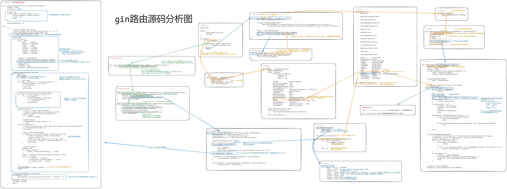

# Gin路由

## Radix Tree

gin框架使用的是定制版本的[httprouter](https://github.com/julienschmidt/httprouter)，其路由的原理是使用了Radix Tree（基数树），也就是具有公共前缀的节点共享一个公共父节点

Trie，被称为前缀树或字典树，是一种有序树，其中的键通常是单词和字符串，所以又有人叫它单词查找树。

它是一颗多叉树，即每个节点分支数量可能为多个，根节点不包含字符串。

从根节点到某一节点，路径上经过的字符连接起来，为该节点对应的字符串。

除根节点外，每一个节点只包含一个字符。

每个节点的所有子节点包含的字符都不相同。

优点：利用字符串公共前缀来减少查询时间，减少无谓的字符串比较

以下为一个简单的前缀树（Perfix Tree）


Radix Tree可以让我们很方便的由路由得到其对应的路由树

```go
r := gin.Default()

r.GET("/", func1)
r.GET("/search/", func2)
r.GET("/support/", func3)
r.GET("/blog/", func4)
r.GET("/blog/:post/", func5)
r.GET("/about-us/", func6)
r.GET("/about-us/team/", func7)
r.GET("/contact/", func8)
```

路由树：

```
Priority   Path             Handle
9          \                *<1>
3          ├s               nil
2          |├earch\         *<2>
1          |└upport\        *<3>
2          ├blog\           *<4>
1          |    └:post      nil
1          |         └\     *<5>
2          ├about-us\       *<6>
1          |        └team\  *<7>
1          └contact\        *<8>
```

这样当我们的路由访问符合上述的规则时，就可以统一执行后面的Handle函数

路由器会为每一个方法（`GET`，`POST`等）分别管理一棵单独的树

同时，每个树级别上的子节点都按Priority(优先级)排序，其中优先级（最左列）就是在子节点(子节点、子子节点等等)中注册的句柄（函数）的数量。这样做有两个好处:

- 首先优先匹配被大多数路由路径包含的节点，这样可以让尽可能多的路由快速被定位

- 类似于成本补偿：最长的路径可以被优先匹配

  补偿体现在最长的路径需要花费更长的时间来定位，如果最长路径的节点能被优先匹配（即每次拿子节点都命中），那么路由匹配所花的时间不一定比短路径的路由长

下面的动图可以具体展示出如何搭建Radix Tree


## 路由入口

以下是一个简单的gin程序

```go
package main

import (
	"github.com/gin-gonic/gin"
	"net/http"
)

func main() {
	r := gin.Default()

	r.GET("/", func(c *gin.Context) {
		c.String(http.StatusOK, "ok")
	})
	r.Run()
}
```

当我们运行一个gin程序时，`r.run()`将会首先加载路由启动，我们从这里开始看

gin路由源码分析图




