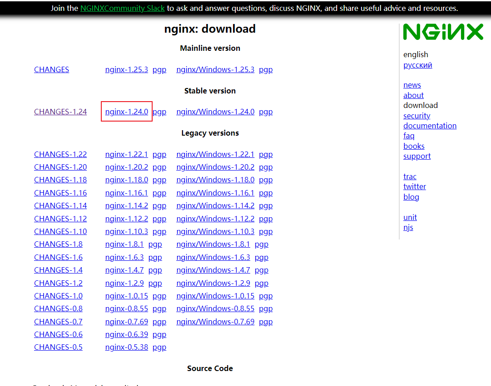

# nginx1.24.0安装(centos7)

## 0 下载依赖

```bash
yum update -y
yum -y install gcc gcc-c++ pcre pcre-devel  zlib zlib-devel openssl openssl-devel libxml2-devel libxslt-devel gd-devel GeoIP-devel jemalloc-devel libatomic_ops-devel perl-devel  perl-ExtUtils-Embed
 
#安装Nginx需要先将官网下载的源码进行编译，依赖gcc环境
 
#PCRE是一个perl库，包括perl兼容的正则表达式库。Nginx的http模块使用pcre库来解析正则表达式 
 
#zlib库提供很多种压缩解压缩方式，Nginx使用zlib对http包的内容进行gzip
 
#OpenSSL是一个强大的安全套接字层密码库，囊括主要的密码算法、常用的秘钥和证书封装管理功能及
SSL协议，并提供丰富的应用程序供测试或其它目的使用。Nginx不仅支持http协议，还支持HTTPS协议
（即在SSL协议上传输http）。
```

## 1 下载

去这个链接：<https://nginx.org/en/download.html>



```bash
cd /opt
wget https://nginx.org/download/nginx-1.24.0.tar.gz
ls

[root@cs opt]# ls
nginx-1.24.0.tar.gz
```

## 2 解压

```bash
cd /opt
tar -zxvf nginx-1.24.0.tar.gz
```

## 3 编译安装，我按照方式3走的

注意：nginx的解压目录和编译目录不能是同一文件夹。

### 方式1：一切都安装默认安装：

```bash
cd /opt/nginx-1.24.0
./configure && make && make install

# 这种方式nginx的安装目录为/usr/local/nginx
```

### 方式2：按照默认编译，并且指定安装目录：

```bash
cd /opt
mkdir my_nginx
cd /opt/nginx-1.24.0
./configure --prefix=/opt/my_nginx --with-http_stub_status_module --with-http_ssl_module
```

没有报错的情况：

```bash
Configuration summary
  + using system PCRE library
  + using system OpenSSL library
  + using system zlib library

  nginx path prefix: "/opt/my_nginx"
  nginx binary file: "/opt/my_nginx/sbin/nginx"
  nginx modules path: "/opt/my_nginx/modules"
  nginx configuration prefix: "/opt/my_nginx/conf"
  nginx configuration file: "/opt/my_nginx/conf/nginx.conf"
  nginx pid file: "/opt/my_nginx/logs/nginx.pid"
  nginx error log file: "/opt/my_nginx/logs/error.log"
  nginx http access log file: "/opt/my_nginx/logs/access.log"
  nginx http client request body temporary files: "client_body_temp"
  nginx http proxy temporary files: "proxy_temp"
  nginx http fastcgi temporary files: "fastcgi_temp"
  nginx http uwsgi temporary files: "uwsgi_temp"
  nginx http scgi temporary files: "scgi_temp"
```

接下来进行编译安装：

```bash
make -j$(nproc) && make install -j$(nproc)
```

看下安装目录：

```bash
cd /opt/my_nginx
ls

[root@cs my_nginx]# ls
client_body_temp  fastcgi_temp  logs     proxy_temp  scgi_temp
conf              html          modules  sbin        uwsgi_temp
```

在nginx的安装目录中：

-   conf：存放nginx配置文件目录
-   logs：存放nginx日志目录
-   sbin：存放nginx可执行脚本目录
-   html：存放nginx的网站站点，静态资源的目录

知道主要的目录作用，我们也就可以启动nginx了。

```bash
cd /opt/my_nginx/sbin
./nginx
ps -ef|grep nginx

[root@cs sbin]# ps -ef|grep nginx
root      39441      1  0 22:37 ?        00:00:00 nginx: master process ./nginx
nobody    39442  39441  0 22:37 ?        00:00:00 nginx: worker process
root      39444  73894  0 22:37 pts/1    00:00:00 grep --color=auto nginx
```

浏览器直接访问你的ip地址就可以看到了：


如果想要在任意目录输入`nginx`即可启动，那还需要配置nginx的环境变量。

## 4 配置nginx环境变量

```bash
echo "export PATH=/opt/my_nginx/sbin:\$PATH" >> /etc/profile
source /etc/profile
```

此时，就可以在任意位置启动nginx了。

## 5 配置启动方式

### 5.1 直接nginx命令启动

```bash
# 直接输入nginx来启动，但只能首次启动nginx使用，因为重复启动的话，会提示80端口已被占用
nginx

# 查看nginx相关进程
ps -ef | grep nginx

# 查看NGINX监听的端口
netstat -tunlp | grep nginx

# 平滑重启nginx，也就是重新读取nginx的配置文件，而不是重启进程
nginx -s reload

# 确认nginx配置文件是否正确的
nginx -t 
# 停止nginx， 杀死nginx进程
nginx -s stop
```

### 5.2 配置systemctl管理nginx

systemd 配置文件说明：

-   每一个 Unit 都需要有一个配置文件用于告知 systemd 对于服务的管理方式
-   配置文件存放于 /usr/lib/systemd/system/，设置开机启动后会在 /etc/systemd/system 目录建立软链接文件
-   每个Unit的配置文件配置默认后缀名为.service
-   在 /usr/lib/systemd/system/ 目录中分为 system 和 user 两个目录，一般将开机不登陆就能运行的程序存在系统服务里，也就是 /usr/lib/systemd/system
-   配置文件使用方括号分成了多个部分，并且区分大小写

我们来配置下：

```bash
cat >/lib/systemd/system/nginx.service<<EOF
[Unit]
Description=nginx
After=network.target
 
[Service]
Type=forking
ExecStartPre=/opt/my_nginx/sbin/nginx -t -c /opt/my_nginx/conf/nginx.conf
ExecStart=/opt/my_nginx/sbin/nginx -c /opt/my_nginx/conf/nginx.conf
ExecReload=/opt/my_nginx/sbin/nginx -s reload
ExecStop=/opt/my_nginx/sbin/nginx -s stop
PrivateTmp=true
[Install]
WantedBy=multi-user.target
EOF
cat /lib/systemd/system/nginx.service
```

解释版：

```bash
cat >/lib/systemd/system/nginx.service<<EOF
[Unit]     # 记录service文件的通用信息
Description=nginx    # Nginx服务描述信息
After=network.target    # Nginx服务启动依赖，在指定服务之后启动
[Service]    # 记录service文件的service信息
Type=forking    # 标准UNIX Daemon使用的启动方式
ExecStartPre=/opt/my_nginx/sbin/nginx -t -c /opt/my_nginx/conf/nginx.conf
ExecStart=/opt/my_nginx/sbin/nginx -c /opt/my_nginx/conf/nginx.conf
ExecReload=/opt/my_nginx/sbin/nginx -s reload
ExecStop=/opt/my_nginx/sbin/nginx -s stop
PrivateTmp=true
[Install]    # 记录service文件的安装信息
WantedBy=multi-user.target    # 多用户环境下启用
EOF
cat /lib/systemd/system/nginx.service
```

然后执行如下命令：

```bash
pkill nginx
systemctl daemon-reload
systemctl start nginx
systemctl status nginx
systemctl stop nginx
```

