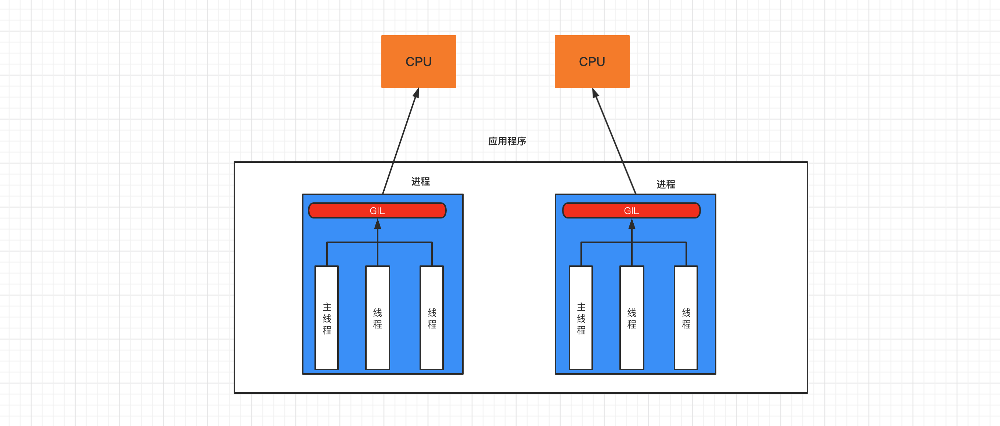
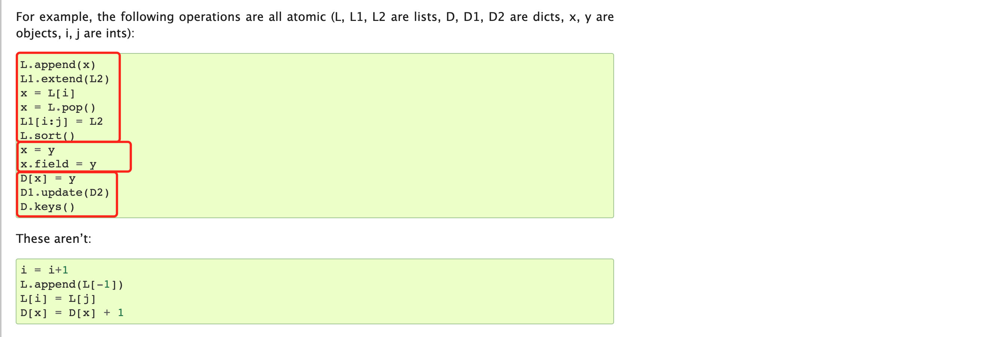

# 线程

## 1. 进程和线程

先来了解下进程和线程。

类比：

- 一个**工厂**，至少有一个**车间**，一个车间中至少有一个**工人**，最终是工人在工作。

- 一个**程序**，至少有一个**进程**，一个进程中至少有一个**线程**，最终是线程在工作。

  ```
  上述串行的代码示例就是一个程序，在使用python xx.py 运行时，内部就创建一个进程（主进程），在进程中创建了一个线程（主线程），由线程逐行运行代码。
  ```

进程和线程：

- 线程，是计算机中可以被cpu调度的最小单元(真正在工作）。
- 进程，是计算机资源分配的最小单元（进程为线程提供资源）。

一个进程中可以有多个线程,同一个进程中的线程可以共享此进程中的资源。


以前我们开发的程序中所有的行为都只能通过串行的形式运行，排队逐一执行，前面未完成，后面也无法继续。例如：

```python
result = 0
for i in range(100000000):
    result += i
print(result)
```

```python
import time
import requests

url_list = [
    ("抖音视频1.mp4", "https://v26-web.douyinvod.com/d715a7c5935857e3135400032fc7297e/66518623/video/tos/cn/tos-cn-ve-15/o0nQXgbOIVmul8IAehaBAsCoD5RAMgFg9EflJu/?a=6383&ch=5&cr=3&dr=0&lr=all&cd=0%7C0%7C0%7C3&cv=1&br=1753&bt=1753&cs=0&ds=4&ft=LjhJEL998xXdu4PmD0P58lZW_3iXwPklxVJE3QwCPCPD-Ipz&mime_type=video_mp4&qs=0&rc=N2VlNzo3NGg8Omg2NGRmNkBpMzxvMzk6ZmVocTMzNGkzM0A0YTBeYTQzXjExYDMyMmEuYSNpL15mcjQwNGdgLS1kLS9zcw%3D%3D&btag=c0000e00038000&cquery=100B_100H_100K_100a_101s&dy_q=1716614580&feature_id=46a7bb47b4fd1280f3d3825bf2b29388&l=2024052513225947A31C5B1D32D47EA5B6"),
    ("抖音视频2.mp4", "https://v3-web.douyinvod.com/e710348d50895f395cbb045ec2b1f7a3/665184ca/video/tos/cn/tos-cn-ve-15c001-alinc2/oEtAtSQNceDyABDgfmLV9WgbcDILbAanEK50wG/?a=6383&ch=5&cr=3&dr=0&lr=all&cd=0%7C0%7C0%7C3&cv=1&br=955&bt=955&cs=0&ds=6&ft=LjhJEL998xXdu4PmD0P58lZW_3iXU4klxVJE3QwCPCPD-Ipz&mime_type=video_mp4&qs=12&rc=MzpnNDllOWRoM2QzZmhkO0BpM3R2ODg6ZjhnczMzNGkzM0AvNjZjMTE2X14xNjVjNV5iYSNtM2trcjRfYjJgLS1kLTBzcw%3D%3D&btag=c0000e00028000&cquery=100B_100H_100K_100a_101s&dy_q=1716614607&feature_id=46a7bb47b4fd1280f3d3825bf2b29388&l=202405251323263CE1D887DFEBCC8E1816"),
]

print(time.time())
for file_name, url in url_list:
    res = requests.get(url)
    with open(file_name, mode='wb') as f:
        f.write(res.content)
    print(file_name, time.time())
```

通过 **进程** 和 **线程** 都可以将 `串行` 的程序变为`并发`，对于上述示例来说就是同时下载两个视频，这样很短的时间内就可以下载完成。


### 1.1 多线程

基于多线程对上述串行示例进行优化：

- 一个**工厂**，创建一个**车间**，这个车间中创建 **3个工人**，并行处理任务。
- 一个**程序**，创建一个**进程**，这个进程中创建 **3个线程**，并行处理任务。

```python
import time
import requests
import threading
"""
def func(a1,a2,a3):
    pass
t = threaing.Thread(target=函数名,args=参数)
例如：t = threaing.Thread(target=func,args=(11,22,33))
t.start()	# 创建好线程并让线程开始工作
"""

url_list = [
    ("抖音视频1.mp4", "https://v26-web.douyinvod.com/d715a7c5935857e3135400032fc7297e/66518623/video/tos/cn/tos-cn-ve-15/o0nQXgbOIVmul8IAehaBAsCoD5RAMgFg9EflJu/?a=6383&ch=5&cr=3&dr=0&lr=all&cd=0%7C0%7C0%7C3&cv=1&br=1753&bt=1753&cs=0&ds=4&ft=LjhJEL998xXdu4PmD0P58lZW_3iXwPklxVJE3QwCPCPD-Ipz&mime_type=video_mp4&qs=0&rc=N2VlNzo3NGg8Omg2NGRmNkBpMzxvMzk6ZmVocTMzNGkzM0A0YTBeYTQzXjExYDMyMmEuYSNpL15mcjQwNGdgLS1kLS9zcw%3D%3D&btag=c0000e00038000&cquery=100B_100H_100K_100a_101s&dy_q=1716614580&feature_id=46a7bb47b4fd1280f3d3825bf2b29388&l=2024052513225947A31C5B1D32D47EA5B6"),
    ("抖音视频2.mp4", "https://v3-web.douyinvod.com/e710348d50895f395cbb045ec2b1f7a3/665184ca/video/tos/cn/tos-cn-ve-15c001-alinc2/oEtAtSQNceDyABDgfmLV9WgbcDILbAanEK50wG/?a=6383&ch=5&cr=3&dr=0&lr=all&cd=0%7C0%7C0%7C3&cv=1&br=955&bt=955&cs=0&ds=6&ft=LjhJEL998xXdu4PmD0P58lZW_3iXU4klxVJE3QwCPCPD-Ipz&mime_type=video_mp4&qs=12&rc=MzpnNDllOWRoM2QzZmhkO0BpM3R2ODg6ZjhnczMzNGkzM0AvNjZjMTE2X14xNjVjNV5iYSNtM2trcjRfYjJgLS1kLTBzcw%3D%3D&btag=c0000e00028000&cquery=100B_100H_100K_100a_101s&dy_q=1716614607&feature_id=46a7bb47b4fd1280f3d3825bf2b29388&l=202405251323263CE1D887DFEBCC8E1816"),
]


def task(file_name, video_url):
    res = requests.get(video_url)
    with open(file_name, mode='wb') as f:
        f.write(res.content)
    print(time.time())


for name, url in url_list:
    # 创建线程，让每个线程都去执行task函数（参数不同）
    t = threading.Thread(target=task, args=(name, url))
    t.start()
```


### 1.2 多进程

基于多进程对上述串行示例进行优化：

- 一个**工厂**，创建 **三个车间**，每个车间 **一个工人（共3人）**，并行处理任务。
- 一个**程序**，创建 **三个进程**，每个进程 **一个线程（共3人）**，并行处理任务。

```python
import time
import requests
import multiprocessing

# 进程创建之后，在进程中还会创建一个线程。
# t = multiprocessing.Process(target=函数名, args=参数)
# t.start()
    
    

url_list = [
    ("抖音视频1.mp4", "https://v26-web.douyinvod.com/d715a7c5935857e3135400032fc7297e/66518623/video/tos/cn/tos-cn-ve-15/o0nQXgbOIVmul8IAehaBAsCoD5RAMgFg9EflJu/?a=6383&ch=5&cr=3&dr=0&lr=all&cd=0%7C0%7C0%7C3&cv=1&br=1753&bt=1753&cs=0&ds=4&ft=LjhJEL998xXdu4PmD0P58lZW_3iXwPklxVJE3QwCPCPD-Ipz&mime_type=video_mp4&qs=0&rc=N2VlNzo3NGg8Omg2NGRmNkBpMzxvMzk6ZmVocTMzNGkzM0A0YTBeYTQzXjExYDMyMmEuYSNpL15mcjQwNGdgLS1kLS9zcw%3D%3D&btag=c0000e00038000&cquery=100B_100H_100K_100a_101s&dy_q=1716614580&feature_id=46a7bb47b4fd1280f3d3825bf2b29388&l=2024052513225947A31C5B1D32D47EA5B6"),
    ("抖音视频2.mp4", "https://v3-web.douyinvod.com/e710348d50895f395cbb045ec2b1f7a3/665184ca/video/tos/cn/tos-cn-ve-15c001-alinc2/oEtAtSQNceDyABDgfmLV9WgbcDILbAanEK50wG/?a=6383&ch=5&cr=3&dr=0&lr=all&cd=0%7C0%7C0%7C3&cv=1&br=955&bt=955&cs=0&ds=6&ft=LjhJEL998xXdu4PmD0P58lZW_3iXU4klxVJE3QwCPCPD-Ipz&mime_type=video_mp4&qs=12&rc=MzpnNDllOWRoM2QzZmhkO0BpM3R2ODg6ZjhnczMzNGkzM0AvNjZjMTE2X14xNjVjNV5iYSNtM2trcjRfYjJgLS1kLTBzcw%3D%3D&btag=c0000e00028000&cquery=100B_100H_100K_100a_101s&dy_q=1716614607&feature_id=46a7bb47b4fd1280f3d3825bf2b29388&l=202405251323263CE1D887DFEBCC8E1816"),
]


def task(file_name, video_url):
    res = requests.get(video_url)
    with open(file_name, mode='wb') as f:
        f.write(res.content)
    print(time.time())


if __name__ == '__main__':
    print(time.time())
    for name, url in url_list:
        t = multiprocessing.Process(target=task, args=(name, url))
        t.start()
```

注：在创建进程的时候，linux内部基于`fork`实现，而python内部基于`spawn`实现。如果是基于`spawn`实现的进程创建，就必须将代码放到`if __name__ == '__main__':`运行，否则会报错

综上所述，我们会发现 **多进程** 的开销比 **多线程** 的开销大


### 1.3 GIL锁

GIL， 全局解释器锁（Global Interpreter Lock），是CPython解释器特有的，让一个进程中同一个时刻只能有一个线程可以被CPU调用。



如果程序想利用 计算机的多核优势，让CPU同时处理一些任务，适合用多进程开发（即使资源开销大）。


如果程序不利用 计算机的多核优势，适合用多线程开发。


常见的程序开发中，计算操作需要使用CPU多核优势，IO操作不需要利用CPU的多核优势，所以，就有这一句话：

- 计算密集型，用多进程，例如：大量的数据计算【累加计算示例】。
- IO密集型，用多线程，例如：文件读写、网络数据传输【下载抖音视频示例】。


累加计算示例（计算密集型）：

- 串行处理

  ```python
  import time
  
  start = time.time()
  
  result = 0
  for i in range(100000000):
      result += i
  print(result)
  
  end = time.time()
  
  print("耗时：", end - start) # 耗时： 5.035789489746094
  ```

- 多进程处理

  ```python
  import time
  import multiprocessing
  
  
  def task(start, end, queue):
      result = 0
      for i in range(start, end):
          result += i
      queue.put(result)
  
  
  if __name__ == '__main__':
      queue = multiprocessing.Queue()
  
      start_time = time.time()
  
      p1 = multiprocessing.Process(target=task, args=(0, 50000000, queue))
      p1.start()
  
      p2 = multiprocessing.Process(target=task, args=(50000000, 100000000, queue))
      p2.start()
  
      v1 = queue.get(block=True)
      v2 = queue.get(block=True)
      print(v1 + v2)
  
      end_time = time.time()
  
      print("耗时:", end_time - start_time)  # 耗时: 1.361469030380249
  ```

  

当然，在程序开发中 多线程 和 多进程 是可以结合使用，例如：创建2个进程（建议与CPU个数相同），每个进程中创建3个线程。

```python
import multiprocessing
import threading


def thread_task():
    pass


def task(start, end):
    t1 = threading.Thread(target=thread_task)
    t1.start()

    t2 = threading.Thread(target=thread_task)
    t2.start()

    t3 = threading.Thread(target=thread_task)
    t3.start()


if __name__ == '__main__':
    p1 = multiprocessing.Process(target=task, args=(0, 50000000))
    p1.start()

    p2 = multiprocessing.Process(target=task, args=(50000000, 100000000))
    p2.start()
```


## 2. 多线程开发

当代码写好后开始运行时，会有一个主线程从上至下运行代码，当运行到`threading.Thread`时会创建一个子线程

```python
import threading

def task(arg):
	pass


# 创建一个Thread对象（线程），并封装线程被CPU调度时应该执行的任务和相关参数。
t = threading.Thread(target=task,args=('xxx',))
# 字线程准备就绪（等待CPU调度），代码继续向下执行。
t.start()

print("继续执行...") # 主线程执行完所有代码，不结束（等所有子线程执行完毕，结束）
```


线程的常见方法：

- `t.start()`，当前线程准备就绪（等待CPU调度，具体时间是由操作系统来决定）。

  ```python
  import threading
  
  loop = 10000000
  number = 0
  
  def _add(count):
      global number
      for i in range(count):
          number += 1
  
  t = threading.Thread(target=_add,args=(loop,))
  t.start()
  
  print(number)
  ```

  这段代码中的number自加操作是由子线程控制的，所以当最后打印number时，number的值时不确定的，主线程并不确定子线程是否执行完

- `t.join()`，等待当前线程的任务执行完毕后再向下继续执行。

  ```python
  import threading
  
  number = 0
  
  def _add():
      global number
      for i in range(10000000):
          number += 1
  
  t = threading.Thread(target=_add)
  t.start()
  
  t.join() # 让主线程等待直至子线程完成
  
  print(number)	# 10000000
  ```

  ```python
  import threading
  
  number = 0
  
  
  def _add():
      global number
      for i in range(10000000):
          number += 1
  
  
  def _sub():
      global number
      for i in range(10000000):
          number -= 1
  
  # 创建两个线程
  t1 = threading.Thread(target=_add)
  t2 = threading.Thread(target=_sub)
  
  # 第一个线程准备完成，可以执行
  t1.start()
  t1.join()  # t1线程执行完毕,才继续往后走
  
  # 第二个线程准备完成，可以执行
  t2.start()
  t2.join()  # t2线程执行完毕,才继续往后走
  
  print(number)	# 0
  ```

  ```python
  import threading
  
  loop = 10000000
  number = 0
  
  
  def _add(count):
      global number
      for i in range(count):
          number += 1
  
  
  def _sub(count):
      global number
      for i in range(count):
          number -= 1
  
  
  t1 = threading.Thread(target=_add, args=(loop,))
  t2 = threading.Thread(target=_sub, args=(loop,))
  
  # 两个线程同时准备完成
  t1.start()
  t2.start()
  
  t1.join()  # t1线程执行完毕,才继续往后走
  t2.join()  # t2线程执行完毕,才继续往后走
  
  print(number)
  ```

  **注**：这段代码在python3.10之前和python3.10之后有不同的返回值

  首先在 Python 字节码执行的时候 ，GIL 并不是随时能在任意位置中断切换线程。只有在主动检测中断的地方才可能发生线程切换。这个是大前提

  - python3.10之前：

  - 因为字节码中+=的操作是两步 opcode 操作，且 INPLACE_ADD 之后 GIL 会主动监测中断，导致虽然加了，但是没有重新赋值，就切换到了别的线程上

    这就导致当两个线程同时执行时，会使同一个cpu来回跳的执行这两个线程（执行一部分t1字线程之后，执行一部分t2子线程，再执行一部分t1字线程，如此重复）

  - python3.10之后：

    GIL 不再会主动检测中断，意味着正常情况下执行完+=之后线程不会被切换，而是正确执行了赋值给 num 的操作

  **补充**：在Python中我们可以通过`dis`模块来获取所定义函数执行流程的字节码

  ```python
  import dis
  
  
  def add(a):
      a = a + 1
      return a
  
  
  print(dis.dis(add))
  ```

  

- `t.daemon = 布尔值` ，守护线程（必须放在start之前）

  - `t.daemon = True`，设置为守护线程，主线程执行完毕后，子线程也自动关闭。
  - `t.daemon = False`，设置为非守护线程，主线程等待子线程，子线程执行完毕后，主线程才结束。（默认）

  ```python
  import threading
  import time
  
  def task(arg):
      time.sleep(5)
      print('任务')
  
  t = threading.Thread(target=task, args=(11,))
  t.daemon = True # True/False
  t.start()
  
  print('END')
  ```

- 线程名称的设置和获取

  ```python
  import threading
  
  
  def task(arg):
      # 获取当前执行此代码的线程
      name = threading.current_thread().name
      print(name)
  
  
  for i in range(10):
      t = threading.Thread(target=task, args=(11,))
      t.name = 'wilson-{}'.format(i)
      t.start()
  ```

- 自定义线程类，直接将线程需要做的事写到run方法中。

  ```python
  import threading
  
  
  class MyThread(threading.Thread):
      def run(self):
          print('执行此线程', self._args)
  
  
  t = MyThread(args=(100,))
  t.start()
  ```

  ```python
  import requests
  import threading
  
  
  class DouYinThread(threading.Thread):
      def run(self):
          file_name, video_url = self._args
          res = requests.get(video_url)
          with open(file_name, mode='wb') as f:
              f.write(res.content)
  
  
  url_list = [
      ("抖音视频1.mp4", "https://v26-web.douyinvod.com/d715a7c5935857e3135400032fc7297e/66518623/video/tos/cn/tos-cn-ve-15/o0nQXgbOIVmul8IAehaBAsCoD5RAMgFg9EflJu/?a=6383&ch=5&cr=3&dr=0&lr=all&cd=0%7C0%7C0%7C3&cv=1&br=1753&bt=1753&cs=0&ds=4&ft=LjhJEL998xXdu4PmD0P58lZW_3iXwPklxVJE3QwCPCPD-Ipz&mime_type=video_mp4&qs=0&rc=N2VlNzo3NGg8Omg2NGRmNkBpMzxvMzk6ZmVocTMzNGkzM0A0YTBeYTQzXjExYDMyMmEuYSNpL15mcjQwNGdgLS1kLS9zcw%3D%3D&btag=c0000e00038000&cquery=100B_100H_100K_100a_101s&dy_q=1716614580&feature_id=46a7bb47b4fd1280f3d3825bf2b29388&l=2024052513225947A31C5B1D32D47EA5B6"),
      ("抖音视频2.mp4", "https://v3-web.douyinvod.com/e710348d50895f395cbb045ec2b1f7a3/665184ca/video/tos/cn/tos-cn-ve-15c001-alinc2/oEtAtSQNceDyABDgfmLV9WgbcDILbAanEK50wG/?a=6383&ch=5&cr=3&dr=0&lr=all&cd=0%7C0%7C0%7C3&cv=1&br=955&bt=955&cs=0&ds=6&ft=LjhJEL998xXdu4PmD0P58lZW_3iXU4klxVJE3QwCPCPD-Ipz&mime_type=video_mp4&qs=12&rc=MzpnNDllOWRoM2QzZmhkO0BpM3R2ODg6ZjhnczMzNGkzM0AvNjZjMTE2X14xNjVjNV5iYSNtM2trcjRfYjJgLS1kLTBzcw%3D%3D&btag=c0000e00028000&cquery=100B_100H_100K_100a_101s&dy_q=1716614607&feature_id=46a7bb47b4fd1280f3d3825bf2b29388&l=202405251323263CE1D887DFEBCC8E1816"),
  ]
  
  for item in url_list:
      t = DouYinThread(args=(item[0], item[1]))
      t.start()
  
  ```

  


## 3. 线程安全

一个进程中可以有多个线程，且线程共享所有进程中的资源。

多个线程同时去操作一个"东西"，**可能**会存在数据混乱的情况

我们可以通过锁的机制来确保线程安全，防止数据混乱

- 示例一：

  ```python
  import threading
  
  lock_object = threading.RLock()
  
  loop = 10000000
  number = 0
  
  
  def _add(count):
      lock_object.acquire() # 加锁
      global number
      for i in range(count):
          number += 1
      lock_object.release() # 释放锁
  
  
  def _sub(count):
      lock_object.acquire() # 申请锁（等待）
      global number
      for i in range(count):
          number -= 1
      lock_object.release() # 释放锁
  
  
  t1 = threading.Thread(target=_add, args=(loop,))
  t2 = threading.Thread(target=_sub, args=(loop,))
  t1.start()
  t2.start()
  
  t1.join()  # t1线程执行完毕,才继续往后走
  t2.join()  # t2线程执行完毕,才继续往后走
  
  print(number)	# 0
  ```

- 示例2：

  ```python
  import threading
  
  num = 0
  
  def task():
      global num
      for i in range(1000000):
          num += 1
      print(num)
  
  
  for i in range(2):
      t = threading.Thread(target=task)
      t.start()
  ```

  ```python
  import threading
  
  num = 0
  lock_object = threading.RLock()
  
  
  def task():
      print("开始")
      lock_object.acquire()  # 第1个抵达的线程进入并上锁，其他线程就需要再此等待。
      global num
      for i in range(1000000):
          num += 1
      lock_object.release()  # 线程出去，并解开锁，其他线程就可以进入并执行了
      print(num)
  
  
  for i in range(2):
      t = threading.Thread(target=task)
      t.start()
  ```

  ```python
  import threading
  
  num = 0
  lock_object = threading.RLock()
  
  
  def task():
      print("开始")
      with lock_object: # 基于上下文管理，内部自动执行 acquire 和 release
          global num
          for i in range(1000000):
              num += 1
      print(num)
  
  
  for i in range(2):
      t = threading.Thread(target=task)
      t.start()
  ```

  

在开发的过程中要注意有些操作默认都是 线程安全的（内部集成了锁的机制），我们在使用的时无需再通过锁再处理，例如：

```python
import threading

data_list = []

lock_object = threading.RLock()


def task():
    print("开始")
    for i in range(1000000):
        data_list.append(i)
    print(len(data_list))


for i in range(2):
    t = threading.Thread(target=task)
    t.start()
```

官方给出的线程安全的操作：



**注意：要多注意看一些开发文档中是否标明线程安全。**


## 4. 线程锁

在程序中如果想要自己手动加锁，一般有两种：Lock 和 RLock。


- Lock，同步锁。

  ```python
  import threading
  
  num = 0
  lock_object = threading.Lock()
  
  
  def task():
      print("开始")
      lock_object.acquire()  # 第1个抵达的线程进入并上锁，其他线程就需要再此等待。
      global num
      for i in range(1000000):
          num += 1
      lock_object.release()  # 线程出去，并解开锁，其他线程就可以进入并执行了
      
      print(num)
  
  
  for i in range(2):
      t = threading.Thread(target=task)
      t.start()
  ```
  
- RLock，递归锁。

  ```python
  import threading
  
  num = 0
  lock_object = threading.RLock()
  
  
  def task():
      print("开始")
      lock_object.acquire()  # 第1个抵达的线程进入并上锁，其他线程就需要再此等待。
      global num
      for i in range(1000000):
          num += 1
      lock_object.release()  # 线程出去，并解开锁，其他线程就可以进入并执行了
      print(num)
  
  
  for i in range(2):
      t = threading.Thread(target=task)
      t.start()
  ```


RLock支持多次申请锁和多次释放；Lock不支持。例如：

```python
import threading
import time

lock_object = threading.RLock()


def task():
    print("开始")
    lock_object.acquire()
    lock_object.acquire()
    print(123)
    lock_object.release()
    lock_object.release()


for i in range(3):
    t = threading.Thread(target=task)
    t.start()
```


## 5.死锁

死锁，由于竞争资源或者由于彼此通信而造成的一种阻塞的现象。

两种死锁情况：

```python
import threading

num = 0
lock_object = threading.Lock()


def task():
    print("开始")
    lock_object.acquire()  # 第1个抵达的线程进入并上锁，其他线程就需要再此等待。
    lock_object.acquire()  # 第1个抵达的线程进入并上锁，其他线程就需要再此等待。
    global num
    for i in range(1000000):
        num += 1
    lock_object.release()  # 线程出去，并解开锁，其他线程就可以进入并执行了
    lock_object.release()  # 线程出去，并解开锁，其他线程就可以进入并执行了
    
    print(num)


for i in range(2):
    t = threading.Thread(target=task)
    t.start()
```

```python
import threading
import time 

lock_1 = threading.Lock()
lock_2 = threading.Lock()


def task1():
    lock_1.acquire()
    time.sleep(1)
    lock_2.acquire()
    print(11)
    lock_2.release()
    print(111)
    lock_1.release()
    print(1111)


def task2():
    lock_2.acquire()
    time.sleep(1)
    lock_1.acquire()
    print(22)
    lock_1.release()
    print(222)
    lock_2.release()
    print(2222)


t1 = threading.Thread(target=task1)
t1.start()

t2 = threading.Thread(target=task2)
t2.start()
```


## 6.线程池

Python3中官方才正式提供线程池。

线程不是开的越多越好，开的多了可能会导致系统的性能更低了，例如：如下的代码是不推荐在项目开发中编写。


**不建议**：无限制的创建线程。

```python
import threading


def task(video_url):
    pass

url_list = ["www.xxxx-{}.com".format(i) for i in range(30000)]

for url in url_list:
    t = threading.Thread(target=task, args=(url,))
    t.start()

# 这种每次都创建一个线程去操作，创建任务的太多，线程就会特别多，可能效率反倒降低了。
```

**建议**：使用线程池

示例1：

```python
import time
from concurrent.futures import ThreadPoolExecutor

# pool = ThreadPoolExecutor(100)	# 线程池中可以维护100个线程
# pool.submit(函数名,参数1，参数2，参数...)	# 将一个任务推到线程池中执行


def task(video_url,num):
    print("开始执行任务", video_url)
    time.sleep(5)

# 创建线程池，最多维护10个线程。
pool = ThreadPoolExecutor(10)

url_list = ["www.xxxx-{}.com".format(i) for i in range(300)]

for url in url_list:
    pool.submit(task, url,2)	# 主线程将300个任务同时交给线程池，但是由于线程池只能同时维护10个线程，所以线程池会去其中10个线程执行，其余的290个线程则等待，如果有线程执行完成，则填充
    
print("END")
```


示例2：`pool.shutdown(True)`

主线程等待线程池的任务执行完毕。

```python
import time
from concurrent.futures import ThreadPoolExecutor


def task(video_url):
    print("开始执行任务", video_url)
    time.sleep(5)


# 创建线程池，最多维护10个线程。
pool = ThreadPoolExecutor(10)

url_list = ["www.xxxx-{}.com".format(i) for i in range(300)]
for url in url_list:
    pool.submit(task, url)

print("执行中...")
pool.shutdown(True)  # 主线程等待，等待线程池中的任务执行完毕后，在继续执行
print('继续往下走')
```


示例3：`add_done_callback(函数名)`任务执行完之后再执行函数。

```python
import time
import random
from concurrent.futures import ThreadPoolExecutor, Future


def task(video_url):
    print("开始执行任务", video_url)
    time.sleep(2)
    return random.randint(0, 10)


def done(response):
    print("任务执行后的返回值", response.result())


# 创建线程池，最多维护10个线程。
pool = ThreadPoolExecutor(10)

url_list = ["www.xxxx-{}.com".format(i) for i in range(15)]

for url in url_list:
    future = pool.submit(task, url)
    future.add_done_callback(done) # 当线程池中每一个线程任务执行完成之后，就会执行done函数
```


示例4：最终统一获取结果。

```python
import time
import random
from concurrent.futures import ThreadPoolExecutor,Future


def task(video_url):
    print("开始执行任务", video_url)
    time.sleep(2)
    return random.randint(0, 10)


# 创建线程池，最多维护10个线程。
pool = ThreadPoolExecutor(10)

future_list = []

url_list = ["www.xxxx-{}.com".format(i) for i in range(15)]
for url in url_list:
    future = pool.submit(task, url)
    future_list.append(future)
    
pool.shutdown(True)
for fu in future_list:
    print(fu.result())
```


```python

```


## 7.单例模式


面向对象 + 多线程相关的一个面试题（以后项目和源码中会用到）。


之前写一个类，每次执行 `类()` 都会实例化一个类的对象。

```python
class Foo:
    pass

obj1 = Foo()

obj2 = Foo()
print(obj1,obj2)
```


以后开发会遇到单例模式，每次实例化类的对象时，都是最开始创建的那个对象，不再重复创建对象。


- 简单的实现单例模式

  ```python
  class Singleton:
      instance = None
  
      def __init__(self, name):
          self.name = name
  
      def __new__(cls, *args, **kwargs):
          # 返回空对象
          if cls.instance:
              return cls.instance
          cls.instance = object.__new__(cls)
          return cls.instance
  
  
  obj1 = Singleton('wilson1')
  obj2 = Singleton('wilson2')
  
  print(obj1, obj2)
  ```

- 多线程执行单例模式，有BUG

  10个线程刚开始同时来实例化对象的时候，都会停在`__new__`方法中`time.sleep`前，然后会同时实例化多个对象，导致单例模式失效

  如果没有加`time.sleep`，可能会因为第一个线程执行比较快，实例化好对象后已经将对象赋给instance变量，导致其余9个线程不会走到实例化，看似实现了单例模式，实则具有偶然性

  ```python
  import threading
  import time
  
  
  class Singleton:
      instance = None
  
      def __init__(self, name):
          self.name = name
  
      def __new__(cls, *args, **kwargs):
          if cls.instance:
              return cls.instance
          time.sleep(0.1)
          cls.instance = object.__new__(cls)
          return cls.instance
  
  
  def task():
      obj = Singleton('x')
      print(obj)
  
  
  for i in range(10):
      t = threading.Thread(target=task)
      t.start()
  ```

- 加锁解决BUG：在构造方法中加锁，会将同时到来的10个线程卡住，只有一个线程可以进入实例化，并将对象赋值给instance变量，然后其余线程执行时，由于instance对象有值，就不会走实例化对象，由此实现单例模式

  ```python
  import threading
  import time
  
  
  class Singleton:
      instance = None
      lock = threading.RLock()
  
      def __init__(self, name):
          self.name = name
  
      def __new__(cls, *args, **kwargs):
          with cls.lock:
              if cls.instance:
                  return cls.instance
              time.sleep(0.1)
              cls.instance = object.__new__(cls)
          return cls.instance
  
  
  def task():
      obj = Singleton('x')
      print(obj)
  
  
  for i in range(10):
      t = threading.Thread(target=task)
      t.start()
  
  ```

- 加判断，提升性能

  在申请锁的上方多加一层判断，这样当我们在代码后期再次需要实例化对象时，我们就可以免除申请锁的资源占用
  
  ```python
  import threading
  import time
  
  
  class Singleton:
      instance = None
      lock = threading.RLock()
  
      def __init__(self, name):
          self.name = name
  
      def __new__(cls, *args, **kwargs):
          if cls.instance:
              return cls.instance
          with cls.lock:
              if cls.instance:
                  return cls.instance
              time.sleep(0.1)
              cls.instance = object.__new__(cls)
          return cls.instance
  
  
  def task():
      obj = Singleton('x')
      print(obj)
  
  
  for i in range(10):
      t = threading.Thread(target=task)
      t.start()
  
  data = Singleton('wilson')
  print(data)
  ```


