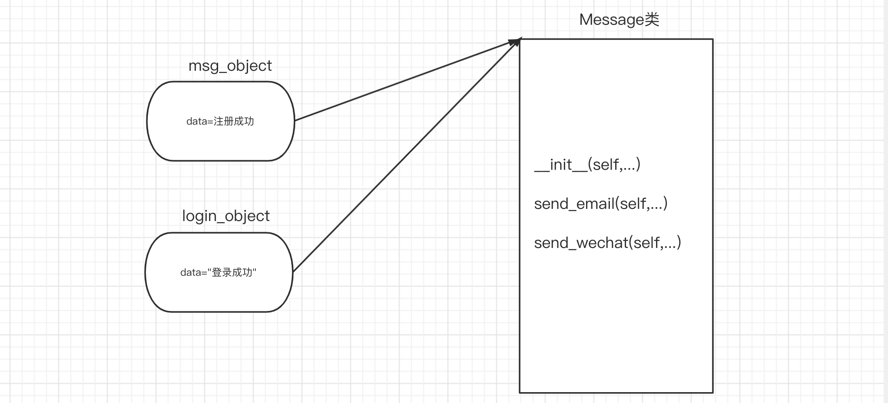
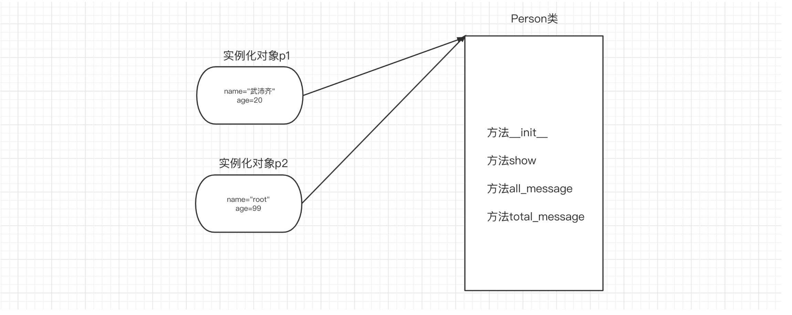
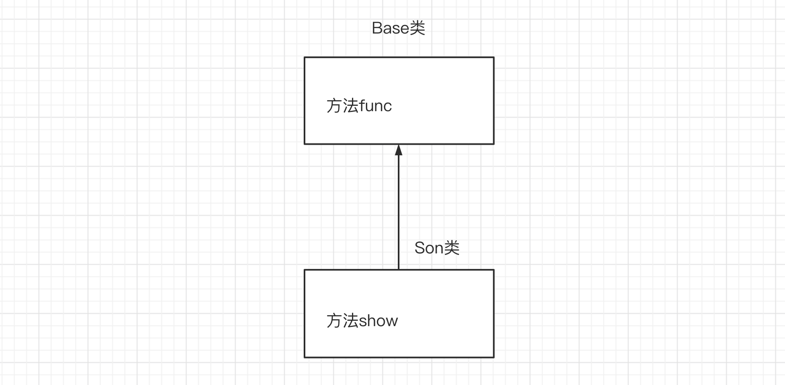
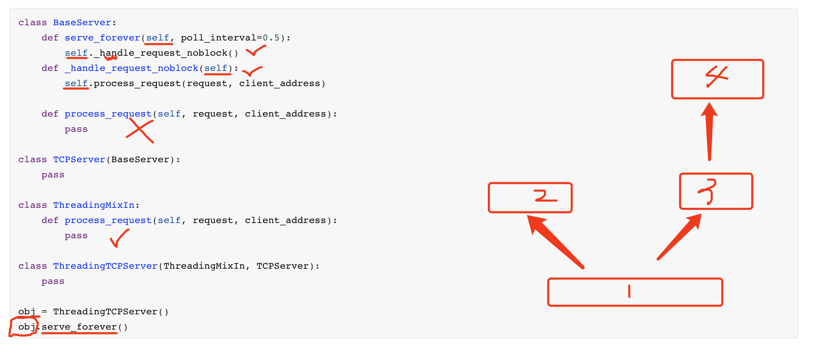
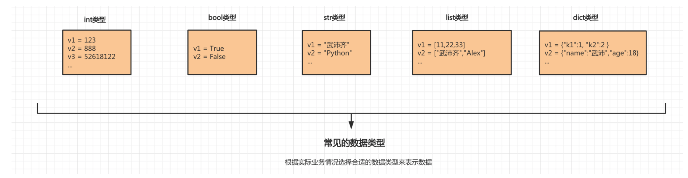

# self对象，封装，继承，多态

## 1. self对象

### 1.1 对象和self

在每个类中都可以定义个特殊的：`__init__ 初始化方法 `，在实例化类创建对象时自动执行，即：`对象=类()`。

```python
class Message:

    def __init__(self, content):
        self.data = content

    def send_email(self, email):
        data = "给{}发邮件，内容是：{}".format(email, self.data)
        print(data)

    def send_wechat(self, vid):
        data = "给{}发微信，内容是：{}".format(vid, self.data)
        print(data)

# 对象 = 类名() # 自动执行类中的 __init__ 方法。

# 1. 根据类型创建一个对象，内存的一块 区域 。
# 2. 执行__init__方法，模块会将创建的那块区域的内存地址当self参数传递进去。    往区域中(data="注册成功")
msg_object = Message("注册成功")

msg_object.send_email("wupeiqi@live.com") # 给wupeiqi@live.com发邮件，内容是：注册成功
msg_object.send_wechat("武沛齐") # 给武沛齐发微信，内容是：注册成功
```



通过上述的示例，你会发现：

- 对象，让我们可以在它的内部先封装一部分数据，以后想要使用时，再去里面获取。
- self，类中的方法需要由这个类的对象来触发并执行（ 对象.方法名 ），且在执行时会自动将对象当做参数传递给self，以供方法中获取对象中已封装的值。

注意：除了self默认参数以外，方法中的参数的定义和执行与函数是相同。


当然，根据类也可以创建多个对象并执行其中的方法，例如：

```python
class Message:

    def __init__(self, content):
        self.data = content

    def send_email(self, email):
        data = "给{}发邮件，内容是：{}".format(email, self.data)
        print(data)

    def send_wechat(self, vid):
        data = "给{}发微信，内容是：{}".format(vid, self.data)
        print(data)


msg_object = Message("注册成功")
msg_object.send_email("wupeiqi@live.com") # 给wupeiqi@live.com发邮件，内容是：注册成功
msg_object.send_wechat("武沛齐")


login_object = Message("登录成功")
login_object.send_email("wupeiqi@live.com") # 给wupeiqi@live.com发邮件，内容是：登录成功
login_object.send_wechat("武沛齐")
```


面向对象的思想：将一些数据封装到对象中，在执行方法时，再去对象中获取。

函数式的思想：函数内部需要的数据均通过参数的形式传递。


- self，本质上就是一个参数。这个参数是Python内部会提供，其实本质上就是调用当前方法的那个对象。
- 对象，基于类实例化出来”一块内存“，默认里面没有数据；经过类的 `__init__`方法，可以在内存中初始化一些数据。


### 1.2 常见成员

在编写面向对象相关代码时，最常见成员有：

- 实例变量，属于对象，只能通过对象调用。
- 绑定方法，属于类，通过对象调用 或 通过类调用。

注意：还有很多其他的成员，后续再来介绍。



```python
class Person:

    def __init__(self, n1, n2):
        # 实例变量
        self.name = n1
        self.age = n2
	
    # 绑定方法
    def show(self):
        msg = "我叫{}，今年{}岁。".format(self.name, self.age)
        print(msg)

    def all_message(self):
        msg = "我是{}人，我叫{}，今年{}岁。".format(Person.country, self.name, self.age)
        print(msg)

    def total_message(self):
        msg = "我是{}人，我叫{}，今年{}岁。".format(self.country, self.name, self.age)
        print(msg)
```

```python
# 执行绑定方法
p1 = Person("武沛齐",20)
p1.show()
# 或
# p1 = Person("武沛齐",20)
# Person.show(p1)


# 初始化，实例化了Person类的对象叫p1
p1 = Person("武沛齐",20)
```


### 1.3 应用示例

1. 将数据封装到一个对象，便于以后使用。

   ```python
   class UserInfo:
       def __init__(self, name, pwd,age):
           self.name = name
           self.password = pwd
           self.age = age
   
   
   def run():
       user_object_list = []
       # 用户注册
       while True:
           user = input("用户名：")
           if user.upper() == "Q":
               break
           pwd = input("密码")
           
           # user_object对象中有：name/password
           user_object = UserInfo(user, pwd,19)
           # user_dict = {"name":user,"password":pwd}
           
           user_object_list.append(user_object)
           # user_object_list.append(user_dict)
   
       # 展示用户信息
       for obj in user_object_list:
           print(obj.name, obj.password)
           
   总结：
   	- 数据封装到对象，以后再去获取。
       - 规范数据（约束）
   ```
   
   注意：用字典也可以实现做封装，只不过字典在操作值时还需要自己写key，面向对象只需要 `.` 即可获取对象中封装的数据。
   
2. 将数据分装到对象中，在方法中对原始数据进行加工处理。

   ```python
   user_list = ["用户-{}".format(i) for i in range(1,3000)]
   
   # 分页显示，每页显示10条
   while True:
       page = int(input("请输入页码："))
   
       start_index = (page - 1) * 10
       end_index = page * 10
   
       page_data_list = user_list[start_index:end_index]
       for item in page_data_list:
           print(item)
   ```

   ```python
   class Pagination:
       def __init__(self, current_page, per_page_num=10):
           self.per_page_num = per_page_num
           
           if not current_page.isdecimal():
               self.current_page = 1
               return
           current_page = int(current_page)
           if current_page < 1:
               self.current_page = 1
               return
           self.current_page = current_page
   
       def start(self):
           return (self.current_page - 1) * self.per_page_num
   
       def end(self):
           return self.current_page * self.per_page_num
   
   
   user_list = ["用户-{}".format(i) for i in range(1, 3000)]
   
   # 分页显示，每页显示10条
   while True:
       page = input("请输入页码：")
   	
       # page，当前访问的页码
       # 10，每页显示10条数据
   	# 内部执行Pagination类的init方法。
       pg_object = Pagination(page, 20)
       page_data_list = user_list[ pg_object.start() : pg_object.end() ]
       for item in page_data_list:
           print(item)
   ```

   

   还有这个示例：将数据封装到一个对象中，然后再方法中对已封装的数据进行操作。

   ```python
   import os
   import requests
   
   
   class DouYin:
       def __init__(self, folder_path):
           self.folder_path = folder_path
           
           if not os.path.exists(folder_path):    # 判断文件夹是否存在
               os.makedirs(folder_path)    # 不存在，则创建文件夹
               
   
       def download(self, file_name, url):
           res = requests.get(
               url=url,
               headers={
                   "user-agent": "Mozilla/5.0 (Macintosh; Intel Mac OS X 10_15_7) AppleWebKit/537.36 (KHTML, like Gecko) Chrome/87.0.4280.88 Safari/537.36 FS"
               }
           )
           file_path = os.path.join(self.folder_path, file_name)
           with open(file_path, mode='wb') as f:
               f.write(res.content)
               f.flush()
   
       def multi_download(self, video_list):
           for item in video_list:
               self.download(item[0], item[1])
   
   
   if __name__ == '__main__':
       douyin_object = DouYin("videos")
   
       douyin_object.download(
           "罗斯.mp4",
           "https://aweme.snssdk.com/aweme/v1/playwm/?video_id=v0200f240000buuer5aa4tij4gv6ajqg"
       )
   
       video_list = [
           ("a1.mp4", "https://aweme.snssdk.com/aweme/v1/playwm/?video_id=v0300fc20000bvi413nedtlt5abaa8tg"),
           ("a2.mp4", "https://aweme.snssdk.com/aweme/v1/playwm/?video_id=v0d00fb60000bvi0ba63vni5gqts0uag"),
           ("a3.mp4", "https://aweme.snssdk.com/aweme/v1/playwm/?video_id=v0200f240000buuer5aa4tij4gv6ajqg")
       ]
       douyin_object.multi_download(video_list)
   
   
   ```

3. 根据类创建多个对象，在方法中对对象中的数据进行修改。

   ```python
   class Police:
       """警察"""
   
       def __init__(self, name, role):
           self.name = name
           self.role = role
           if role == "队员":
               self.hit_points = 200
           else:
               self.hit_points = 500
   
       def show_status(self):
           """ 查看警察状态 """
           message = "警察{}的生命值为:{}".format(self.name, self.hit_points)
           print(message)
   
       def bomb(self, terrorist_list):
           """ 投炸弹，炸掉恐怖分子 """
           for terrorist in terrorist_list:
               terrorist.blood -= 200
               terrorist.show_status()
   
   """
   p1 = Police("武沛齐","队员")
   p1.show_status()
   p1.bomb(["alex","李杰"])
   
   p2 = Police("日天","队长")
   p2.show_status()
   p2.bomb(["alex","李杰"])
   """
   
   
   
   class Terrorist:
       """ 恐怖分子 """
   
       def __init__(self, name, blood=300):
           self.name = name
           self.blood = blood
   
       def shoot(self, police_object):
           """ 开枪射击某个警察 """
           police_object.hit_points -= 5
           police_object.show_status()
           
           self.blood -= 2
   
       def strafe(self, police_object_list):
           """ 扫射某些警察 """
           for police_object in police_object_list:
               police_object.hit_points -= 8
               police_object.show_status()
   
       def show_status(self):
           """ 查看恐怖分子状态 """
           message = "恐怖分子{}的血量值为:{}".format(self.name, self.blood)
           print(message)
   
   """
   t1 = Terrorist('alex')
   t2 = Terrorist('李杰',200)
   """
           
   def run():
       # 1.创建3个警察
       p1 = Police("武沛齐", "队员")
       p2 = Police("苑昊", "队员")
       p3 = Police("于超", "队长")
   
       # 2.创建2个匪徒
       t1 = Terrorist("alex")
       t2 = Terrorist("eric")
       
   
       # alex匪徒射击于超警察
       t1.shoot(p3)
   
       # alex扫射
       t1.strafe([p1, p2, p3])
   
       # eric射击苑昊
       t2.shoot(p2)
   
       # 武沛齐炸了那群匪徒王八蛋
       p1.bomb([t1, t2])
       
       # 武沛齐又炸了一次alex
       p1.bomb([t1])
   
   
   if __name__ == '__main__':
       run()
   ```

   


总结：

- 仅做数据封装。
- 封装数据 + 方法再对数据进行加工处理。
- 创建同一类的数据且同类数据可以具有相同的功能（方法）。


## 2. 三大特性

面向对象编程在很多语言中都存在，这种编程方式有三大特性：封装、继承、多态。


### 2.1 封装

封装主要体现在两个方面：

- 将同一类方法封装到了一个类中，例如上述示例中：匪徒的相关方法都写在Terrorist类中；警察的相关方法都写在Police类中。
- 将数据封装到了对象中，在实例化一个对象时，可以通过`__init__`初始化方法在对象中封装一些数据，便于以后使用。


### 2.2 继承

传统的理念中有：儿子可以继承父亲的财产。

在面向对象中也有这样的理念，即：子类可以继承父类中的方法和类变量（不是拷贝一份，父类的还是属于父类，子类可以继承而已）。

```
父类
子类

基类
派生类
```




```python
class Base:

    def func(self):
        print("Base.func")

class Son(Base):
    
    def show(self):
        print("Son.show")
        
s1 = Son()
s1.show()
s1.func() # 优先在自己的类中找，自己没有才去父类。

s2 = Base()
s2.func()
```


```python
class Base:
    def f1(self):
        pass

class Foo(Base):

    def f2(self):
        pass
    
class Bar(Base):
    
    def f3(self):
        pass
    
o1 = Foo()
o1.f2()
o1.f1()
```


### 练习题

```python
class Base:
    def f1(self):
        print('base.f1')
        
class Foo(Base):
    def f2(self):
        print('foo.f2')
        
obj = Foo()
obj.f1()
obj.f2()
```


```python
class Base:
    def f1(self):
        print('base.f1')
        
class Foo(Base):
    def f2(self):
        print('before')
        self.f1() # 调用了f1方法   obj.f1()
        print('foo.f2')
        
obj = Foo()
obj.f2()

>>> before
>>> base.f1
>>> foo.f2
```


```python
class Base:
    def f1(self):
        print('base.f1')
        
class Foo(Base):
    def f2(self):
        print("before")
        self.f1() # obj,Foo类创建出来的对象。 obj.f1
        print('foo.f2')
	def f1(self):
        print('foo.f1')
        
obj = Foo()
obj.f1() # obj对象到底是谁？优先就会先去谁里面找。
obj.f2()

>>> before
>>> foo.f1
>>> foo.f2
```


```python
class Base:
    def f1(self):
        print('before')
        self.f2() # slef是obj对象（Foo类创建的对象） obj.f2
        print('base.f1')
        
	def f2(self):
        print('base.f2')
        
class Foo(Base):
    def f2(self):
        print('foo.f2')
        
obj = Foo()
obj.f1() # 优先去Foo类中找f1，因为调用f1的那个对象是Foo类创建出来的。


>>> before
>>> foo.f2
>>> base.f1

b1 = Base()
b1.f1()

>>> before
>>> base.f2
>>> base.f1
```


```python
class TCPServer:
    def f1(self):
        print("TCPServer")

class ThreadingMixIn:
    def f1(self):
        print("ThreadingMixIn")

class ThreadingTCPServer(ThreadingMixIn, TCPServer): 
    def run(self):
        print('before')
        self.f1()
        print('after')
        
obj = ThreadingTCPServer()
obj.run()

>>> before
>>> ThreadingMixIn
>>> after
```


```python
class BaseServer:
    def serve_forever(self, poll_interval=0.5):
        self._handle_request_noblock()
	def _handle_request_noblock(self):
        self.process_request(request, client_address)
        
	def process_request(self, request, client_address):
        pass
    
class TCPServer(BaseServer):
    pass

class ThreadingMixIn:
    def process_request(self, request, client_address):
        pass
    
class ThreadingTCPServer(ThreadingMixIn, TCPServer): 
    pass

obj = ThreadingTCPServer()
obj.serve_forever()
```




小结：

- 执行对象.方法时，优先去当前对象所关联的类中找，没有的话才去她的父类中查找。
- Python支持多继承：先继承左边、再继承右边的。
- self到底是谁？去self对应的那个类中去获取成员，没有就按照继承关系向上查找 。


### 2.3 多态

多态，按字面翻译其实就是多种形态。

- 其他编程语言多态
- Python中多态


其他编程语言中，是不允许这样类编写的，例如：Java

```java
class Cat{  
    public void eat() {  
        System.out.println("吃鱼");  
    }  
}

class Dog {  
    public void eat() {  
        System.out.println("吃骨头");  
    }  
    public void work() {  
        System.out.println("看家");  
    }  
}


public class Test {
   public static void main(String[] args) {
       obj1 = Cat()
	   obj2 = Cat()
       show(obj1)
       show(obj2)
           
		obj3 = Dog()
        show(obj3)
   }  
    
    public static void show(Cat a)  {
      a.eat()
    }  
} 
```

```java
abstract class Animal {  
    abstract void eat();  
}  

class Cat extends Animal {  
    public void eat() {  
        System.out.println("吃鱼");  
    }  
}

class Dog extends Animal {  
    public void eat() {  
        System.out.println("吃骨头");  
    }  
    public void work() {  
        System.out.println("看家");  
    }  
}


public class Test {
   public static void main(String[] args) {
       obj1 = Cat()
       show(obj1)
           
	   obj2 = Dog()
	   show(obj2)
   }  
    
    public static void show(Animal a)  {
      a.eat()
    }  
} 
```

在java或其他语言中的多态是基于：接口 或 抽象类和抽象方法来实现，让数据可以以多种形态存在。


在Python中则不一样，由于Python对数据类型没有任何限制，所以他天生支持多态。

```python
def func(arg):
    v1 = arg.copy() # 浅拷贝
    print(v1)
    
func("武沛齐")
func([11,22,33,44])
```

```python
class Email(object):
    def send(self):
        print("发邮件")

        
class Message(object):
    def send(self):
        print("发短信")
        
        
        
def func(arg):
    v1 = arg.send()
    print(v1)
    

v1 = Email()
func(v1)

v2 = Message()
func(v2)
```

在程序设计中，鸭子类型（duck typing）是动态类型的一种风格。在鸭子类型中，关注点在于对象的行为，能作什么；而不是关注对象所属的类型，例如：一只鸟走起来像鸭子、游泳起来像鸭子、叫起来也像鸭子，那么这只鸟可以被称为鸭子。


小结：

- 封装，将方法封装到类中 或 将数据封装到对象中，便于以后使用。

- 继承，将类中的公共的方法提取到基类中去实现。

- 多态，Python默认支持多态（这种方式称之为鸭子类型），最简单的基础下面的这段代码即可。

  ```python
  def func(arg):
      v1 = arg.copy() # 浅拷贝
      print(v1)
      
  func("武沛齐")
  func([11,22,33,44])
  ```

  


## 3. 扩展：再看数据类型

在初步了解面向对象之后，再来看看我们之前学习的：str、list、dict等数据类型，他们其实都一个类，根据类可以创建不同类的对象。




```python
# 实例化一个str类的对象v1
v1 = str("武沛齐") 

# 通过对象执行str类中的upper方法。
data = v1.upper()

print(data)
```


## 4. mro和c3算法

对于Python面向对象中的继承，我们已学过：

- 继承存在意义：将公共的方法提取到父类中，有利于增加代码重用性。

- 继承的编写方式：

  ```python
  # 继承
  class Base(object):
      pass
  
  class Foo(Base):
      pass
  ```

  ```python
  # 多继承
  class Base(object):
      pass
  
  class Bar(object):
      pass
  
  class Foo(Base,Bar):
      pass
  ```

- 调用类中的成员时，遵循：

  - 优先在自己所在类中找，没有的话则去父类中找。
  - 如果类存在多继承（多个父类），则先找左边再找右边。

上述的知识点掌握之后，其实就可以解决继承相关的大部分问题。

但如果遇到一些特殊情况（不常见），你就可能不知道怎么搞了，例如：


如果类中存在继承关系，在可以通过`mro()`获取当前类的继承关系（找成员的顺序）。


示例1：


```python
mro(A) = [A] + [B,C]
mro(A) = [A,B,C]
```

```python
mro(A) = [A] + merge( mro(B), mro(C), [B,C] )
mro(A) = [A] + merge( [object], [object], [] )
mro(A) = [A] + [B,C,object]
mro(A) = [A,B,C,object]
```

```python
mro(A) = [A] + merge( mro(B), mro(C), [B,C] )
mro(A) = [A] + merge( [], [C], [,C] 
mro(A) = [A] + [B,C]
```


```python
class C(object):
    pass

class B(object):
    pass

class A(B, C):
    pass

print( A.mro() )   # [<class '__main__.A'>, <class '__main__.B'>, <class '__main__.C'>, <class 'object'>]
print( A.__mro__ ) # (<class '__main__.A'>, <class '__main__.B'>, <class '__main__.C'>, <class 'object'>)
```


示例2：


```python
mro(A) = [A] + merge( mro(B), mro(C), [B,C] )
mro(A) = [A] + merge( [], [D], [] )
mro(A) = [A] + [B,C,D]
mro(A) = [A,B,C,D]
```


```python
class D(object):
    pass


class C(D):
    pass


class B(object):
    pass


class A(B, C):
    pass


print( A.mro() ) # [<class '__main__.A'>, <class '__main__.B'>, <class '__main__.C'>, <class '__main__.D'>, <class 'object'>]
```


示例3:


```python
mro(A) = [A] + merge( mro(B),mro(C),[B,C])
mro(A) = [A] + merge( [], [C], [C])
mro(A) = [A,B,D,C]
```


```python
class D(object):
    pass


class C(object):
    pass


class B(D):
    pass


class A(B, C):
    pass


print(A.mro()) # [<class '__main__.A'>, <class '__main__.B'>, <class '__main__.D'>, <class '__main__.C'>, <class 'object'>]
```


示例4：


```python
mro(A) = [A] + merge( mro(B), mro(C), [B,C])

mro(A) = [A] + merge( [B,D], [C,D], [B,C])

mro(A) = [A] + [B,C,D] 
mro(A) = [A,B,C,D] 
```

```python
class D(object):
    pass


class C(D):
    pass


class B(D):
    pass


class A(B, C):
    pass


print(A.mro()) # [<class '__main__.A'>, <class '__main__.B'>, <class '__main__.C'>, <class '__main__.D'>, <class 'object'>]
```


示例5：


```python
简写为：A -> B -> D -> G -> H -> K -> C -> E -> F -> M -> N -> P -> object
```


```
mro(A) = [A] + merge( mro(B),          mro(C),      mro(P),      [B,C,P])
                  []   [N]     [P]          [P]

mro(A) = [A,B,D,G,H,K,C,E,F,M,N,P]

-----------------------------------------------------
mro(B) = [B] + merge( mro(D), mro(E), [D,E])

mro(D) = [D] + merge(mro(G),mro(H), [G,H])

mro(G) = [G]

mro(H) = [H,K]

mro(B) = [B] + merge( [], [E,M], [E])
mro(B) = [B,D,G,H,K,E,M]


-----------------------------------------------------
mro(C) = [C] + merge(mro(E),mro(F),[E,F])

mro(E) = [E,M]

mro(F) = [F,M,N] 

mro(C) = [C] + merge([M],[M,N] ,[])
mro(C) = [C,E,F,M,N]
```

```python
class M:
    pass


class N:
    pass


class E(M):
    pass


class G:
    pass


class K:
    pass


class H(K):
    pass


class D(G, H):
    pass


class F(M, N):
    pass


class P:
    pass


class C(E, F):
    pass


class B(D, E):
    pass


class A(B, C, P):
    pass


print(A.mro()) # 简写为：A -> B -> D -> G -> H -> K -> C -> E -> F -> M -> N -> P -> object
```


**特别补充：一句话搞定继承关系**

不知道你是否发现，如果用正经的C3算法规则去分析一个类继承关系有点繁琐，尤其是遇到一个复杂的类也要分析很久。

所以，我自己根据经验总结了一句话赠送给大家：<span style="color:red">**从左到右，深度优先，大小钻石，留住顶端**</span>，基于这句话可以更快的找到继承关系。


```
简写为：A -> B -> D -> G -> H -> K -> C -> E -> F -> M -> N -> P -> object
```


#### py2和py3区别（了解）

概述：

- 在python2.2之前，只支持经典类【从左到右，深度优先，大小钻石，不留顶端】

- 后来，Python想让类默认继承object（其他语言的面向对象基本上也都是默认都继承object），此时发现原来的经典类不能直接集成集成这个功能，有Bug。

- 所以，Python决定不再原来的经典类上进行修改了，而是再创建一个新式类来支持这个功能。【从左到右，深度优先，大小钻石，留住顶端。】

  - 经典类，不继承object类型

    ```python
    class Foo:
        pass
    ```

  - 新式类，直接或间接继承object

    ```python
    class Base(object):
        pass
    
    class Foo(Base):
        pass
    ```

- 这样，python2.2之后 中就出现了经典类和新式类共存。（正式支持是2.3）

- 最终，python3中丢弃经典类，只保留新式类。


```
详细文档：
	https://www.python.org/dev/peps/pep-0253/#mro-method-resolution-order-the-lookup-rule
	https://www.python.org/download/releases/2.3/mro/

In classic Python, the rule is given by the following recursive function, also known as the left-to-right depth-first rule.

def classic_lookup(cls, name):
    if cls.__dict__.has_key(name):
        return cls.__dict__[name]
    for base in cls.__bases__:
        try:
            return classic_lookup(base, name)
        except AttributeError:
            pass
    raise AttributeError, name
    
The problem with this becomes apparent when we consider a "diamond diagram":

      class A:
        ^ ^  def save(self): ...
       /   \
      /     \
     /       \
    /         \
class B     class C:
    ^         ^  def save(self): ...
     \       /
      \     /
       \   /
        \ /
      class D
      

Arrows point from a subtype to its base type(s). This particular diagram means B and C derive from A, and D derives from B and C (and hence also, indirectly, from A).

Assume that C overrides the method save(), which is defined in the base A. (C.save() probably calls A.save() and then saves some of its own state.) B and D don't override save(). When we invoke save() on a D instance, which method is called? According to the classic lookup rule, A.save() is called, ignoring C.save()!

This is not good. It probably breaks C (its state doesn't get saved), defeating the whole purpose of inheriting from C in the first place.

Why was this not a problem in classic Python? Diamond diagrams are rarely found in classic Python class hierarchies. Most class hierarchies use single inheritance, and multiple inheritance is usually confined to mix-in classes. In fact, the problem shown here is probably the reason why multiple inheritance is unpopular in classic Python.

Why will this be a problem in the new system? The 'object' type at the top of the type hierarchy defines a number of methods that can usefully be extended by subtypes, for example __getattr__().

(Aside: in classic Python, the __getattr__() method is not really the implementation for the get-attribute operation; it is a hook that only gets invoked when an attribute cannot be found by normal means. This has often been cited as a shortcoming -- some class designs have a legitimate need for a __getattr__() method that gets called for all attribute references. But then of course this method has to be able to invoke the default implementation directly. The most natural way is to make the default implementation available as object.__getattr__(self, name).)

Thus, a classic class hierarchy like this:

class B     class C:
    ^         ^  def __getattr__(self, name): ...
     \       /
      \     /
       \   /
        \ /
      class D
      

will change into a diamond diagram under the new system:

      object:
        ^ ^  __getattr__()
       /   \
      /     \
     /       \
    /         \
class B     class C:
    ^         ^  def __getattr__(self, name): ...
     \       /
      \     /
       \   /
        \ /
      class D


and while in the original diagram C.__getattr__() is invoked, under the new system with the classic lookup rule, object.__getattr__() would be invoked!

Fortunately, there's a lookup rule that's better. It's a bit difficult to explain, but it does the right thing in the diamond diagram, and it is the same as the classic lookup rule when there are no diamonds in the inheritance graph (when it is a tree).
```

总结：Python2和Python3在关于面向对象的区别。

- Py2：

  - 经典类，未继承object类型。【从左到右，深度优先，大小钻石，不留顶端】

    ```python
    class Foo:
        pass
    ```

  - 新式类，直接获取间接继承object类型。【从左到右，深度优先，大小钻石，留住顶端 -- C3算法】

    ```python
    class Foo(object):
        pass
    ```

      或

      ```python
    class Base(object):
        pass
    
    class Foo(Base):
        pass
      ```

- Py3

  - 新式类，丢弃了经典类只保留了新式类。【从左到右，深度优先，大小钻石，留住顶端 -- C3算法】

    ```python
    class Foo:
        pass
    
    class Bar(object):
        pass
    ```


