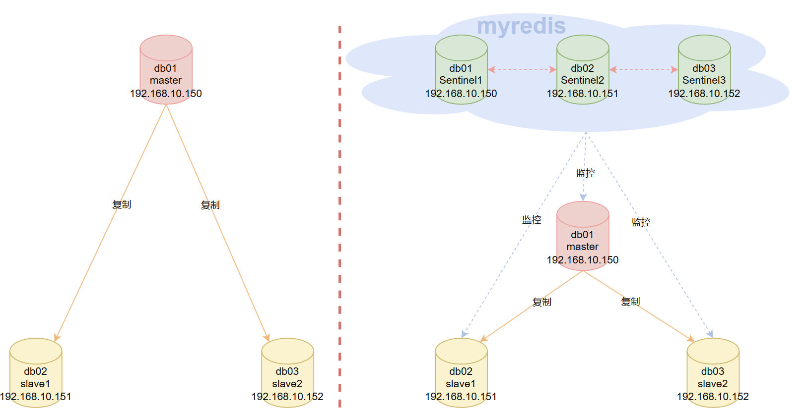

# Redis哨兵Sentinel

哨兵主要解决主从复制的问题：

- 主从复制需要人为进行干预，比如主从复制不会自动故障转移。
- 提供了自动故障转移的高可用性。

哨兵主要执行行以下三个任务：

- **监控（Monitoring）**： Sentinel 会不断地检查你的主节点和从节点是否运作正常。
- **提醒（Notification）**： 当被监控的某个 Redis 服务器出现问题时， Sentinel 可以通过 API 向管理员或者其他应用程序发送通知。
- **自动故障迁移（Automatic failover）**： 当一个主节点不能正常工作时, Sentinel 会开始一次自动故障迁移操作， 它会将失效主节点的其中一个从节点升级为新的主节点， 并让失效主节点的其他从节点改为复制新的主节点； 当客户端试图连接失效的主节点时, Sentinel 也会向客户端返回新主节点的地址， 使得 Sentinel 可以使用新主节点代替失效服务器。

Redis Sentinel 是一个分布式系统， 你可以在一个架构中运行多个 Sentinel 进程（progress）， 这些进程使用流言协议（gossip protocols)来接收关于主节点是否下线的信息， 并使用投票协议（agreement protocols）来决定是否执行自动故障迁移， 以及选择哪个从节点作为新的主节点。

另外，哨兵节点是特殊Redis节点，本身不负责存储数据。

## 部署主从复制和哨兵

### 目录、端口、服务器规划

官方建议，最少有三个节点组成一个哨兵监控组，并且要有一个组名，哨兵也是一个Redis实例，哨兵可以和Redis数据实例部署在一个服务器上。

我这里准备3台centos7服务器，硬件一致，Redis版本都是5.0.7



**端口规划**

```bash
# redis数据节点，正常监听6379端口
# 哨兵节点，监听26379节点
```

**服务器规划**

```bash
# db01: 192.168.10.150
	centinel1
	redis master
# db02: 192.168.10.151
	centinel2
	redis slave1	
# db03: 192.168.10.152
	centinel3
	redis slave2		
```

**目录规划，每台服务器都一样**

```bash
# redis数据节点
/opt/redis6379/{conf,logs,pid}   	# 配置目录，日志目录，pid目录
/data/redis6379/					# 数据存放目录
/opt/redis-5.0.7/					# 安装目录

# 哨兵节点
/opt/redis26379/{conf,logs,pid}   	# 配置目录，日志目录，pid目录
/data/redis26379/					# 数据存放目录
```

## 主从复制部署

哨兵要监听每一个主从节点，所以，我们先把主从复制关系搞定。

先把所有的节点服务器都关闭防火墙和下载一些必要的工具

```bash
systemctl stop firewalld.service
systemctl disable firewalld.service
systemctl status firewalld.service
sed -i.ori 's#SELINUX=enforcing#SELINUX=disabled#g' /etc/selinux/config
yum update -y
yum -y install gcc automake autoconf libtool make
yum -y install net-tools vim wget lrzsz

# 后面配置用到了一个小知识点
# $(ifconfig ens33|awk 'NR==2{print $2}') 这条shell的意思是获取本机的IP地址
# 有的服务器叫做ens33，也有的可能是eth0，可以通过ifconfig命令确认
[root@cs ~]# echo $(ifconfig ens33|awk 'NR==2{print $2}')
192.168.10.150
```

### **每台服务器配置Redis**

db01

```bash
systemctl stop redis
cat >/opt/redis6379/conf/redis6379.conf <<EOF 
daemonize yes
bind $(ifconfig ens33|awk 'NR==2{print $2}') 127.0.0.1 
port 6379
pidfile "/opt/redis6379/pid/redis6379.pid"
logfile "/opt/redis6379/logs/redis6379.log"
dir "/data/redis6379"
save 900 1
save 300 10
save 60 10000
dbfilename "redis.rdb"
appendonly yes
appendfilename "redis.aof"
appendfsync everysec
EOF
systemctl start redis
redis-cli PING
```

db02和db03，都分别执行下面的命令

```bash
# 先分别执行下面的命令，建立免密传输通道
ssh-keygen
ssh-copy-id 192.168.10.150

# 如果你的db02和db03有Redis，可以先停掉
# systemctl stop redis
rm -rf /opt/redis*
rsync -avz 192.168.10.150:/usr/local/bin/redis* /usr/local/bin
rsync -avz 192.168.10.150:/opt/redis* /opt/
rsync -avz 192.168.10.150:/usr/lib/systemd/system/redis.service /usr/lib/systemd/system/

mkdir -p /opt/redis6379/{conf,logs,pid} 
mkdir -p /data/redis6379

cat >/opt/redis6379/conf/redis6379.conf <<EOF 
daemonize yes
bind $(ifconfig ens33|awk 'NR==2{print $2}') 127.0.0.1
port 6379
pidfile "/opt/redis6379/pid/redis6379.pid"
logfile "/opt/redis6379/logs/redis6379.log"
dir "/data/redis6379"
save 900 1
save 300 10
save 60 10000
dbfilename "redis.rdb"
appendonly yes
appendfilename "redis.aof"
appendfsync everysec
EOF

groupadd redis -g 1000
useradd redis -u 1000 -g 1000 -M -s /sbin/nologin
chown -R redis:redis /opt/redis*
chown -R redis:redis /data/redis*
systemctl daemon-reload
systemctl start redis
redis-cli PING
cat /opt/redis6379/conf/redis6379.conf
```

### **配置redis主从复制关系**

redis-cli是可以通过`-h`和`-p`连接远程服务器的，而我们这里每台redis都默认监听6379端口，所以不需要指定`-p`参数

所以，我将在db01上，远程操作两台服务器的redis，与db01建立主从关系

db01操作

```bash
redis-cli -h 192.168.10.151 -p 6379 slaveof 192.168.10.150 6379
redis-cli -h 192.168.10.152 -p 6379 slaveof 192.168.10.150 6379

# 如果数据量较大，可以等一段时间再执行info replication命令
redis-cli -h 192.168.10.150 -p 6379 info replication
redis-cli -h 192.168.10.150 -p 6379 set k1 v111 
redis-cli -h 192.168.10.150 -p 6379 get k1
redis-cli -h 192.168.10.151 -p 6379 get k1
redis-cli -h 192.168.10.152 -p 6379 get k1


[root@cs ~]# redis-cli -h 192.168.10.150 -p 6379 info replication
# Replication
role:master
connected_slaves:2
slave0:ip=192.168.10.152,port=6379,state=online,offset=2168,lag=0
slave1:ip=192.168.10.151,port=6379,state=online,offset=2168,lag=1
master_replid:49f6e22f9628017aea5c3d8b980bf75aa100299d
master_replid2:0000000000000000000000000000000000000000
master_repl_offset:2168
second_repl_offset:-1
repl_backlog_active:1
repl_backlog_size:1048576
repl_backlog_first_byte_offset:1
repl_backlog_histlen:2168
[root@cs ~]# redis-cli -h 192.168.10.150 -p 6379 set k1 v111 
OK
[root@cs ~]# redis-cli -h 192.168.10.150 -p 6379 get k1
"v111"
[root@cs ~]# redis-cli -h 192.168.10.151 -p 6379 get k1
"v111"
[root@cs ~]# redis-cli -h 192.168.10.152 -p 6379 get k1
"v111"
```

## 部署哨兵

### Sentinel 状态的持久化

Sentinel 的状态会被持久化在 Sentinel 配置文件里面。也就是说Sentinel 有个特性就是部署成功之后，它会自动维护更新配置文件，所以，我们只需要把三个哨兵部署起来就好了

三台服务器都是一样的操作。db01、db02、db03都执行下面的命令

```bash
mkdir -p /data/redis26379
mkdir -p /opt/redis26379/{conf,pid,logs}
cat >/opt/redis26379/conf/redis26379.conf << EOF
bind $(ifconfig ens33|awk 'NR==2{print $2}')
port 26379
daemonize yes
logfile /opt/redis26379/logs/redis26379.log
dir /data/redis26379
# 注意修改主节点ip为你真实的主节点IP
sentinel monitor myredis 192.168.10.150 6379 2
sentinel down-after-milliseconds myredis 3000
sentinel parallel-syncs myredis 1
sentinel failover-timeout myredis 180000
EOF

chown -R redis:redis /data/redis*
chown -R redis:redis /opt/redis*
cat >/usr/lib/systemd/system/redis-sentinel.service << EOF
[Unit]
Description=Redis persistent key-value database
After=network.target
After=network-online.target
Wants=network-online.target
[Service]
ExecStart=/usr/local/bin/redis-sentinel /opt/redis26379/conf/redis26379.conf --supervised systemd
ExecStop=/usr/local/bin/redis-cli -h $(ifconfig ens33|awk 'NR==2{print$2}') -p 26379 shutdown
Type=notify
User=redis
Group=redis
RuntimeDirectory=redis
RuntimeDirectoryMode=0755
[Install]
WantedBy=multi-user.target
EOF

systemctl daemon-reload
systemctl start redis-sentinel
redis-cli -h 192.168.10.150 -p 26379 PING
redis-cli -h 192.168.10.151 -p 26379 PING
redis-cli -h 192.168.10.152 -p 26379 PING
```

关键配置解释:

- `sentinel monitor myredis 192.168.10.148 6379 2`，指示 Sentinel 去监视一个别名为 `myredis` 的主节点，主节点的IP地址`192.168.10.150`，端口号为 `6379` ，而将这个主节点判断为失效至少需要 `2` 个 Sentinel 同意 （只要同意 Sentinel 的数量不达标，自动故障迁移就不会执行）
- `sentinel down-after-milliseconds`：选项指定了 Sentinel 认为服务器已经断线所需的毫秒数
  - 如果服务器在给定的毫秒数之内，没有返回 Sentinel 发送的PING命令的回复，或者返回一个错误，那么 Sentinel 将这个服务器标记为**主观下线**（subjectively down，简称 `SDOWN` ）
  - 不过只有一个 Sentinel 将服务器标记为主观下线并不一定会引起服务器的自动故障迁移：只有在足够数量的 Sentinel 都将一个服务器标记为主观下线之后，服务器才会被标记为**客观下线**（objectively down， 简称 `ODOWN` ），这时自动故障迁移才会执行
- `sentinel parallel-syncs`：
  - 故障转移期间从节点向新master节点进行主从同步有关，它规定了每次向新的主节点发起复制操作的从节点个数。例如，假设主节点切换完成之后，有3个从节点要向新的主节点发起复制；如果`parallel-syncs=1`，则从节点会一个一个开始复制；如果`parallel-syncs=3`，则3个从节点会一起开始复制
  - `parallel-syncs`取值越大，从节点完成复制的时间越快，但是对主节点的网络负载、硬盘负载造成的压力也越大；应根据实际情况设置。例如，如果主节点的负载较低，而从节点对服务可用的要求较高，可以适量增加`parallel-syncs`取值。`parallel-syncs`的默认值是1
- `sentinel failover-timeout`：与故障转移超时的判断有关，sentinel在对master进行故障转移时的超时时间，单位毫秒，默认`180000`毫秒，也就是180秒

### 常用的命令

```bash
# 获取主节点的IP和端口，你可以在任意节点执行这个命令
redis-cli -h 192.168.10.150 -p 26379 SENTINEL get-master-addr-by-name myredis
redis-cli -h 192.168.10.151 -p 26379 SENTINEL get-master-addr-by-name myredis
redis-cli -h 192.168.10.152 -p 26379 SENTINEL get-master-addr-by-name myredis

# 返回结果都是一样的
[root@cs ~]# redis-cli -h 192.168.10.150 -p 26379 SENTINEL get-master-addr-by-name myredis
1) "192.168.10.150"
2) "6379


# 查看主节点和从节点的sentinel信息
redis-cli -h 192.168.10.150 -p 26379 SENTINEL master myredis
redis-cli -h 192.168.10.150 -p 26379 SENTINEL slaves myredis
redis-cli -h 192.168.10.150 -p 26379 SENTINEL sentinels myredis


# 查看可用的sentinel节点数量
[root@cs ~]# redis-cli -h 192.168.10.150 -p 26379 SENTINEL ckquorum myredis
OK 3 usable Sentinels. Quorum and failover authorization can be reached
3个可用哨兵节点，达到了仲裁和故障转移的条件了，也就是说能够进行自动故障转移

# 查看可用的sentinel的基本信息
# 总的信息
redis-cli -h 192.168.10.150 -p 26379 INFO
# 总的信息中某一项分类信息
redis-cli -h 192.168.10.150 -p 26379 INFO Sentinel
```

## 哨兵背后的故事(了解)

### 主观下线和客观下线

- 主观下线（Subjectively Down， 简称 SDOWN）指的是单个 Sentinel 实例对服务器做出的下线判断
- 客观下线（Objectively Down， 简称 ODOWN）指的是多个 Sentinel 实例在对同一个服务器做出 SDOWN 判断， 并且通过 `SENTINEL is-master-down-by-addr` 命令互相交流之后， 得出的服务器下线判断 （一个 Sentinel 可以通过向另一个 Sentinel 发送 `SENTINEL is-master-down-by-addr` 命令来询问对方是否认为给定的服务器已下线）

如果一个服务器没有在 `master-down-after-milliseconds` 选项所指定的时间内，对向它发送 `PING`命令的 Sentinel 返回一个有效回复（valid reply），那么 Sentinel 就会将这个服务器标记为主观下线。

服务器对 `PING`命令的有效回复可以是以下三种回复的其中一种：

- 返回 `+PONG`，相当于咱们常用的客户端发送一个`PING`，服务端回复一个`PONG` 。
- 返回 `-LOADING` 加载错误。
- 返回 `-MASTERDOWN` 主节点挂掉了错误。

如果服务器返回除以上三种回复之外的其他回复，又或者在指定时间内没有回复 [PING](https://docs.kilvn.com/redis-doc/connection/ping.html#ping) 命令，那么 Sentinel 认为服务器返回的回复无效（non-valid）

注意，一个服务器必须在 `master-down-after-milliseconds` 毫秒内， 一直返回无效回复才会被 Sentinel 标记为主观下线

举个例子， 如果 `master-down-after-milliseconds` 选项的值为 `30000` 毫秒（`30` 秒），那么只要服务器能在每 `29` 秒之内返回至少一次有效回复，这个服务器就仍然会被认为是处于正常状态的

从主观下线状态切换到客观下线状态并没有使用严格的法定人数算法（strong quorum algorithm）， 而是使用了流言协议： 如果 Sentinel 在给定的时间范围内， 从其他 Sentinel 那里接收到了足够数量的主节点下线报告， 那么 Sentinel 就会将主节点的状态从主观下线改变为客观下线。 如果之后其他 Sentinel 不再报告主节点已下线， 那么客观下线状态就会被移除

客观下线条件**只适用于主节点**： 对于任何其他类型的 Redis 实例， Sentinel 在将它们判断为下线前不需要进行协商， 所以从节点或者其他 Sentinel 永远不会达到客观下线条件

只要一个 Sentinel 发现某个主节点进入了客观下线状态， 这个 Sentinel 就可能会被其他 Sentinel 推选出， 并对失效的主节点执行自动故障迁移操作

### 每个Sentinel都需要定期执行的任务

- 每个 Sentinel 以每两钟一次的频率向它所知的主节点、从节点以及其他 Sentinel 实例发送一个ping命令
- 如果一个实例（instance）距离最后一次有效回复 PING命令的时间超过 `down-after-milliseconds` 选项所指定的值， 那么这个实例会被 Sentinel 标记为主观下线。 一个有效回复可以是： `+PONG` 、 `-LOADING` 或者 `-MASTERDOWN` 
- 如果一个主节点被标记为主观下线，那么正在监视这个主节点的所有 Sentinel 要以每秒一次的频率确认主节点的确进入了主观下线状态。
- 如果一个主节点被标记为主观下线，并且有足够数量的 Sentinel （至少要达到配置文件指定的数量）在指定的时间范围内同意这一判断， 那么这个主节点被标记为客观下线
- 在一般情况下， 每个 Sentinel 会以每 10 秒一次的频率向它已知的所有主节点和从节点发送 info命令。 当一个主节点被 Sentinel 标记为客观下线时， Sentinel 向下线主节点的所有从节点发送 info命令的频率会从 10 秒一次改为每秒一次
- 当没有足够数量的 Sentinel 同意主节点已经下线， 主节点的客观下线状态就会被移除。 当主节点重新向 Sentinel 的ping命令返回有效回复时， 主节点的主管下线状态就会被移除

### 自动发现新的Sentinel和从节点

一个 Sentinel 可以与其他多个 Sentinel 进行连接， 各个 Sentinel 之间可以互相检查对方的可用性， 并进行信息交换

你无须为运行的每个 Sentinel 分别设置其他 Sentinel 的地址， 因为 Sentinel 可以通过发布与订阅功能来自动发现正在监视相同主节点的其他 Sentinel ， 这一功能是通过向频道 `__sentinel__:hello` 发送信息来实现的

与此类似，你也不必手列出主节点属下的所有从节点， 因为 Sentinel 可以通过询问主节点来获得所有从节点的信息

- 每个 Sentinel 会以每两秒一次的频率， 通过发布与订阅功能， 向被它监视的所有主节点和从节点的 `__sentinel__:hello` 频道发送一条信息， 信息中包含了 Sentinel 的 IP 地址、端口号和运行 ID （runid）
- 每个 Sentinel 都订阅了被它监视的所有主节点和从节点的 `__sentinel__:hello` 频道， 查找之前未出现过的 sentinel （looking for unknown sentinels）。 当一个 Sentinel 发现一个新的 Sentinel 时， 它会将新的 Sentinel 添加到一个列表中， 这个列表保存了 Sentinel 已知的， 监视同一个主节点的所有其他 Sentinel 
- Sentinel 发送的信息中还包括完整的主节点当前配置（configuration）。 如果一个 Sentinel 包含的主节点配置比另一个 Sentinel 发送的配置要旧， 那么这个 Sentinel 会立即升级到新配置上
- 在将一个新 Sentinel 添加到监视主节点的列表上面之前， Sentinel 会先检查列表中是否已经包含了和要添加的 Sentinel 拥有相同运行 ID 或者相同地址（包括 IP 地址和端口号）的 Sentinel ， 如果是的话， Sentinel 会先移除列表中已有的那些拥有相同运行 ID 或者相同地址的 Sentinel ， 然后再添加新 Sentinel 。

## 故障转移

Ralt算法参考：https://zhuanlan.zhihu.com/p/32052223

如果一个主节点被标记为客观下线，那么就会Sentinel就会进行自动故障转移操作。

一次故障转移操作由以下步骤组成：

- 发现主节点已经进入客观下线状态
- 先把那些"营养不良"的从节点淘汰掉：
  - 在失效主节点的从节点当中， 那些被标记为主观下线、已断线、或者最后一次回复ping命令的时间大于五秒钟的从节点都会被淘汰
  - 在失效主节点下的从节点当中，那些与失效主节点连接断开的时长超过 `down-after` 选项指定的时长十倍的从节点都会被淘汰
  - 在经历了以上两轮淘汰之后剩下来的从节点中，才是精英，从这精英中，开始进行选举
- 使用Ralt算法划分选举周期，开始进行选举，raft算法可以随机定义一个时间周期，这个周期就是选举的周期，如果该周期中没有选出leader，则进入下个时间周期，Raft将系统中的角色分为领导者（Leader）、跟从者（Follower）和候选人（Candidate）
  - 每个从节点的选举时钟不一样，这样就可以避免所有的从节点向其它节点同时发送选举指令
  - 首先从节点选投票给自己，然后发送请求给其它节点给自己投票
  - 其它从节点收到投票请求之后，先比较优先级，如果自己的大，则给自己投票，否则投票给别人。如果所有从节点的优先级都相同，则比较复制偏移量（从主节点同步的数据偏移量），如果自己大，则给自己投票，否则投票给别人
  - 如果偏移量相同，则比较`runid`(redis的标识，随机生成)，如果自己的小，则投票给自己，否则投票给别人，每个节点只能投票一次，而每个节点有自己的投票箱
  - 最后比较投票的数量，数量最多，则成功上位，称为leader，如果数量相同，那么在设定的故障迁移超时时间的两倍之后，进入下一个选举周期，重新投票
- 经过一顿py交易之后，"幸运的候选人"被选出来了，向被选中的从节点发送 `SLAVEOF NO ONE` 命令，让它转变为主节点。
- 通过发布与订阅功能， 将更新后的配置传播给所有其他 Sentinel ，其他 Sentinel 对它们自己的配置进行更新
- 向其它从节点发送slaveof命令，让它们去复制新的主节点。
- 当所有从节点都已经开始复制新的主节点时，领头 Sentinel 终止这次故障迁移操作

## 实验: 干掉主节点

**首先通过主节点，获取下两个从节点的状态信息（以下为精简版）**

```bash
[root@cs ~]# redis-cli -h 192.168.10.151 -p 26379 SENTINEL slaves myredis
1)  1) "name"
    2) "192.168.10.152:6379"		# 152从节点
    7) "runid"
    8) "f1618c045726b9d93f054badd3b00bfce98cd62e"
   21) "down-after-milliseconds"
   22) "3000"
   37) "slave-priority"				# 权重100
   38) "100"
   39) "slave-repl-offset"			# 偏移量 3137535
   40) "3137535"

2)  1) "name"
    2) "192.168.10.151:6379"		# 151从节点
    7) "runid"
    8) "62bb0e4e5c8b0112185f6c0b5a4123bd65e452c8"
   21) "down-after-milliseconds"
   22) "3000"
   37) "slave-priority"				# 权重100
   38) "100"
   39) "slave-repl-offset"			# 偏移量 3137535
   40) "3137535"

>>> min("f1618c045726b9d93f054badd3b00bfce98cd62e", "62bb0e4e5c8b0112185f6c0b5a4123bd65e452c8")
'62bb0e4e5c8b0112185f6c0b5a4123bd65e452c8'
```

可以看到，两个从节点的权重相同，偏移量相同，那么只能比较runid了，结果151从节点小，那么我们推断151节点，将会成为下一个主节点

**干掉主节点**

我们直接杀掉主节点的redis进程，在db01主节点上进行操作

```bash
# 注意不是 pkill -9 redis，那样会sentinel也干掉了
pkill -9 redis-server

# 然后可以看下此时的主节点是谁
redis-cli -h 192.168.10.150 -p 26379 SENTINEL get-master-addr-by-name myredis
redis-cli -h 192.168.10.150 -p 26379 SENTINEL master myredis

[root@cs ~]# pkill -9 redis-server
[root@cs ~]# redis-cli -h 192.168.10.150 -p 26379 SENTINEL get-master-addr-by-name myredis
1) "192.168.10.151"
2) "6379"
[root@cs ~]# redis-cli -h 192.168.10.150 -p 26379 SENTINEL master myredis
 1) "name"
 2) "myredis"
 3) "ip"
 4) "192.168.10.151"
 5) "port"
 6) "6379"
 7) "runid"
 8) "62bb0e4e5c8b0112185f6c0b5a4123bd65e452c8"
 9) "flags"
10) "master"
```

可以看到，新主节点是符合我们预期的151节点

接下来，我们重启db01的redis实例，它会自动的加入到现有的主从关系中，并成为从节点

```bash
systemctl start redis
redis-cli -h 192.168.10.150 -p 26379 SENTINEL slaves myredis


[root@cs ~]# systemctl start redis
[root@cs ~]# redis-cli -h 192.168.10.150 ROLE
1) "slave"
2) "192.168.10.151"
3) (integer) 6379
4) "connected"
5) (integer) 3237639
[root@cs ~]# redis-cli -h 192.168.10.150 -p 26379 SENTINEL slaves myredis  
1)  1) "name"
    2) "192.168.10.152:6379"
    7) "runid"
    8) "f1618c045726b9d93f054badd3b00bfce98cd62e"
    9) "flags"
   10) "slave"
2)  1) "name"
    2) "192.168.10.150:6379"
    7) "runid"
    8) "182a0bb752ad543c8961d9a35ba52005d10f662b"
    9) "flags"
   10) "slave"			# 如果提示s_down,slave,disconnected，就等会再重新执行命令，因为加入主从复制关系中毕竟需要耗费时间
```

## 主动故障转移

有的时候，我们需要对服务器进行维护等操作，需要临时停机，那么如果该服务器是主节点的话，就需要我们主动让sentinel进行选举，将主节点选到合适的服务器上来，想让谁当领导，这个我们可以说的算

那就是通过控制各个从节点的权重就可以了，先来看各自权重，默认都是100

```bash
redis-cli -h 192.168.10.150 -p 6379 CONFIG GET slave-priority
redis-cli -h 192.168.10.151 -p 6379 CONFIG GET slave-priority
redis-cli -h 192.168.10.152 -p 6379 CONFIG GET slave-priority

[root@cs ~]# redis-cli -h 192.168.10.150 -p 6379 CONFIG GET slave-priority
1) "slave-priority"
2) "100"
[root@cs ~]# redis-cli -h 192.168.10.151 -p 6379 CONFIG GET slave-priority
1) "slave-priority"
2) "100"
[root@cs ~]# redis-cli -h 192.168.10.152 -p 6379 CONFIG GET slave-priority
1) "slave-priority"
2) "100"
```

现在，如果我们想要停止主节点的服务器，要想让150从节点的服务器成为主节点，就可以这样，主动给此时的主节点151的权重和另一个从节点152节点，降低权重，而150节点的权重不变，这样，我们再主动触发选举动作就行了

```bash
# 先给不让当主节点的其它节点将权重
redis-cli -h 192.168.10.151 -p 6379 CONFIG set slave-priority 0
redis-cli -h 192.168.10.152 -p 6379 CONFIG set slave-priority 0

# 想让当主节点的从节点维持权重不变，等于变相的加了权重，这样从新选举时，就能按照我们想要的动作进行选举了
redis-cli -h 192.168.10.150 -p 6379 CONFIG GET slave-priority
redis-cli -h 192.168.10.151 -p 6379 CONFIG GET slave-priority
redis-cli -h 192.168.10.152 -p 6379 CONFIG GET slave-priority

[root@cs ~]# redis-cli -h 192.168.10.151 -p 6379 CONFIG set slave-priority 0
OK
[root@cs ~]# redis-cli -h 192.168.10.152 -p 6379 CONFIG set slave-priority 0
OK
[root@cs ~]# redis-cli -h 192.168.10.150 -p 6379 CONFIG GET slave-priority
1) "slave-priority"
2) "100"
[root@cs ~]# redis-cli -h 192.168.10.151 -p 6379 CONFIG GET slave-priority
1) "slave-priority"
2) "0"
[root@cs ~]# redis-cli -h 192.168.10.152 -p 6379 CONFIG GET slave-priority
1) "slave-priority"
2) "0"
```

然后，主动发生选举

```bash
# 模拟故障转移命令，此命令将使我们的当前主节点不再可用，睡眠 30 秒。 它基本上模拟了由于某种原因而挂起的现象
# redis-cli -h 192.168.10.151 -p 6379 DEBUG sleep 30

# 你也可以指定给哨兵发个让指定主节点failover的命令，内部就会主动进行选举(推荐)
redis-cli -h 192.168.10.150 -p 26379 sentinel failover myredis

# 稍等会再执行，状态改变没那么快
redis-cli -h 192.168.10.150 -p 26379 SENTINEL get-master-addr-by-name myredis

[root@cs ~]# redis-cli -h 192.168.10.151 -p 26379 sentinel failover myredis
OK
[root@cs ~]# redis-cli -h 192.168.10.150 -p 26379 SENTINEL get-master-addr-by-name myredis
1) "192.168.10.150"
2) "6379"
```

当然，别忘了把人家的权重再搞回来

```bash
redis-cli -h 192.168.10.150 -p 6379 CONFIG set slave-priority 100
redis-cli -h 192.168.10.151 -p 6379 CONFIG set slave-priority 100
redis-cli -h 192.168.10.152 -p 6379 CONFIG set slave-priority 100
redis-cli -h 192.168.10.150 -p 6379 CONFIG GET slave-priority
redis-cli -h 192.168.10.151 -p 6379 CONFIG GET slave-priority
redis-cli -h 192.168.10.152 -p 6379 CONFIG GET slave-priority
```

此时150这个服务器成了我们想要的主节点了，你就可以对原来的151节点所在服务器直接停机就好了

```bash
systemctl stop redis
systemctl stop redis-sentinel

[root@cs ~]# systemctl stop redis
[root@cs ~]# systemctl stop redis-sentinel
```

当你修复好了之后，重启sentinel和redis服务，就又能加回来了

```bash
systemctl start redis
systemctl start redis-sentinel
```

## 哨兵和实例节点的删除

向部署好的Sentinel添加一个新的从节点是一个简单的过程，因为Sentinel实现了自动发现机制，我们所需要做的就是启动配置

哨兵永远不会忘记那些已经死去的从节点.......即使他们长时间无法访问。这很有用，因为哨兵应该能够在网络分区或故障事件后正确地重新配置返回的从节点

db03操作

```bash
systemctl stop redis
systemctl stop redis-sentinel

[root@cs ~]# systemctl stop redis
[root@cs ~]# systemctl stop redis-sentinel
# 此时150是主节点
[root@cs ~]# redis-cli -h 192.168.10.150 -p 26379 SENTINEL get-master-addr-by-name myredis
1) "192.168.10.150"
2) "6379"
```

此时，如果你通过主节点查看sentinel状态的话，发现还是两个从节点

```bash
[root@cs ~]# redis-cli -h 192.168.10.150 -p 26379 INFO Sentinel
# Sentinel
sentinel_masters:1
sentinel_tilt:0
sentinel_running_scripts:0
sentinel_scripts_queue_length:0
sentinel_simulate_failure_flags:0
master0:name=myredis,status=ok,address=192.168.10.150:6379,slaves=2,sentinels=3
```

此时，我们要做的就是，刷新所有节点的副本列表，将152的节点信息刷掉

```bash
# 此时，只剩一主(150)一从(151)了，所以，都刷新下
redis-cli -h 192.168.10.150 -p 26379 SENTINEL reset myredis
redis-cli -h 192.168.10.151 -p 26379 SENTINEL reset myredis

# 然后在查看sentinel状态的话，就剩一个从节点了
redis-cli -h 192.168.10.150 -p 26379 INFO Sentinel

# salves这里也就剩一个151了
redis-cli -h 192.168.10.150 -p 26379 SENTINEL slaves myredis

[root@cs ~]# redis-cli -h 192.168.10.150 -p 26379 SENTINEL reset myredis
(integer) 1
[root@cs ~]# redis-cli -h 192.168.10.151 -p 26379 SENTINEL reset myredis
(integer) 1
[root@cs ~]# redis-cli -h 192.168.10.150 -p 26379 INFO Sentinel
# Sentinel
sentinel_masters:1
sentinel_tilt:0
sentinel_running_scripts:0
sentinel_scripts_queue_length:0
sentinel_simulate_failure_flags:0
master0:name=myredis,status=ok,address=192.168.10.150:6379,slaves=1,sentinels=2

[root@cs ~]# redis-cli -h 192.168.10.150 -p 26379 SENTINEL slaves myredis
1)  1) "name"
    2) "192.168.10.151:6379"
    7) "runid"
    8) "06f03d8a9e2d83a3a3f6e701d7a8d04b044c8a88"
    9) "flags"
   10) "slave"
```

这个时候，如果算再重启152节点的哨兵和实例节点，还是会自动加回来，因为上文说过，哨兵部署成功，会自动维护配置文件，我们虽然停掉了哨兵和实例，但对应的配置文件还是记录着相关配置的，所以你启动之后，又会根据配置，自动加回来.......

```bash
systemctl start redis
systemctl start redis-sentinel
cat /opt/redis6379/conf/redis6379.conf 
cat /opt/redis26379/conf/redis26379.conf 

[root@cs ~]# cat /opt/redis6379/conf/redis6379.conf 
daemonize yes
bind 127.0.0.1 192.168.10.152
port 6379
pidfile "/opt/redis6379/pid/redis6379.pid"
logfile "/opt/redis6379/logs/redis6379.log"

dir "/data/redis6379"
dbfilename "redis.rdb"

save 900 1
save 300 10
save 60 10000
rdbcompression yes
rdbchecksum yes

appendonly no
appendfsync everysec
appendfilename "redis.aof"
auto-aof-rewrite-percentage 100
auto-aof-rewrite-min-size 64mb
no-appendfsync-on-rewrite yes

replicaof 192.168.10.150 6379
supervised systemd
replica-priority 0

[root@cs ~]# cat /opt/redis26379/conf/redis26379.conf 
bind 192.168.10.152
port 26379
daemonize yes
logfile "/opt/redis26379/logs/redis26379.log"
dir "/data/redis26379"
sentinel myid c0a5a31223d7bf03ae9a18afb9186d1ca8b96117
sentinel deny-scripts-reconfig yes
sentinel monitor myredis 192.168.10.150 6379 2
sentinel down-after-milliseconds myredis 3000
# Generated by CONFIG REWRITE
maxclients 4064
protected-mode no
supervised systemd
sentinel config-epoch myredis 4
sentinel leader-epoch myredis 2
sentinel known-replica myredis 192.168.10.151 6379
sentinel known-replica myredis 192.168.10.152 6379
sentinel known-sentinel myredis 192.168.10.150 26379 65d579f050686e12fb2a611de970ec8fe56467df
sentinel known-sentinel myredis 192.168.10.151 26379 113180565ac065040b97f65120c0d8b5e1f703b6
sentinel current-epoch 4
```

所以，想要彻底断开实例节点，需要在彻底断开之后，调整两个配置文件

## 哨兵的不足

1. 主节点写压力太大
2. 资源利用率不高
3. 连接过程繁琐，效率低
4. 仍然无法降低主从复制中，数据量过大的问题，毕竟是一主一从就是两份数据，一主多从就更多了.....


