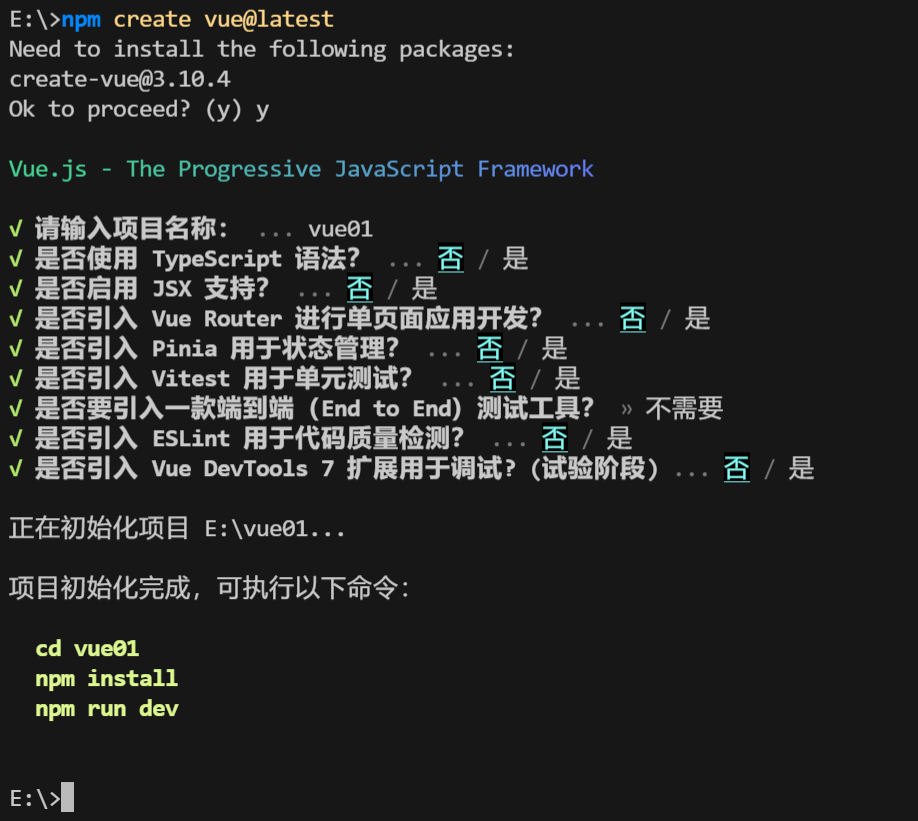
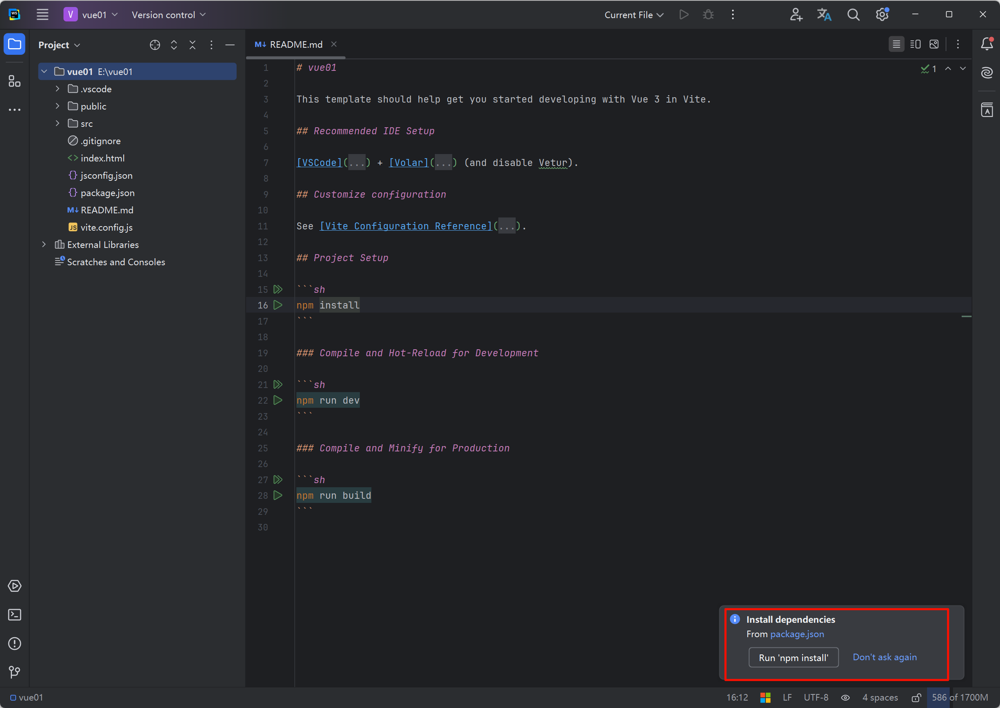
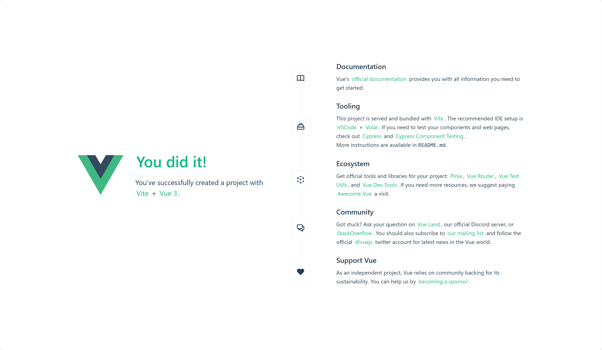
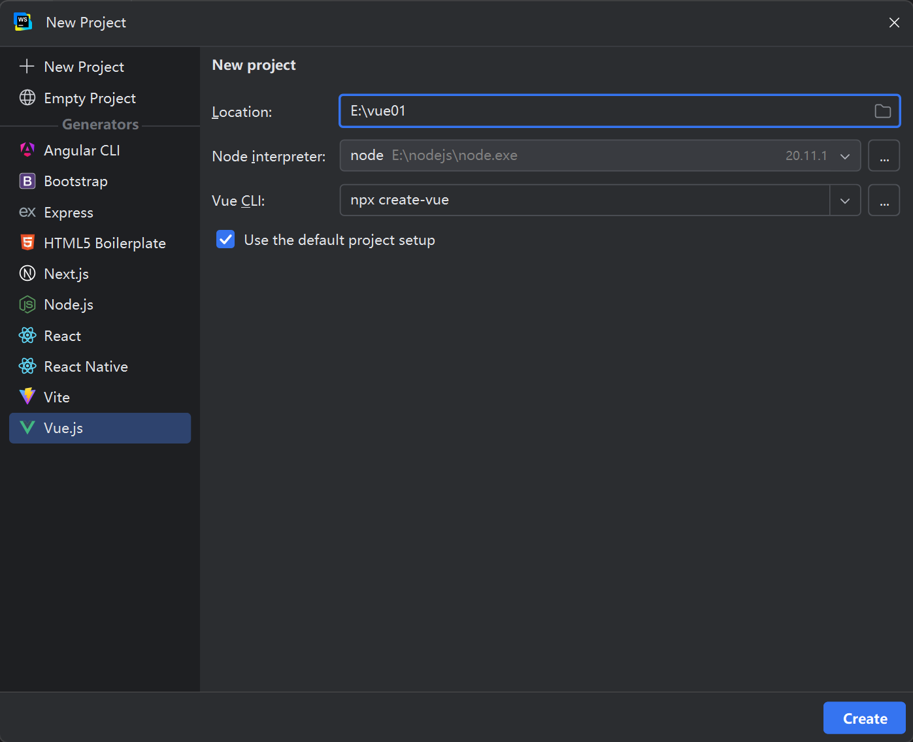
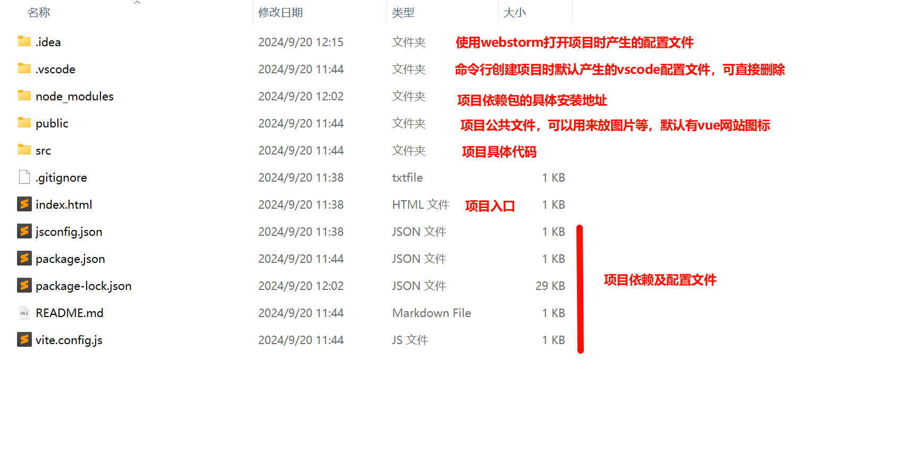
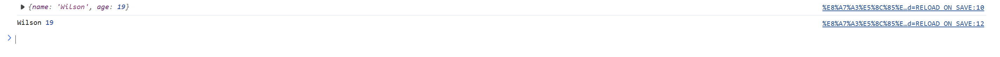
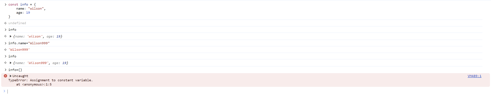
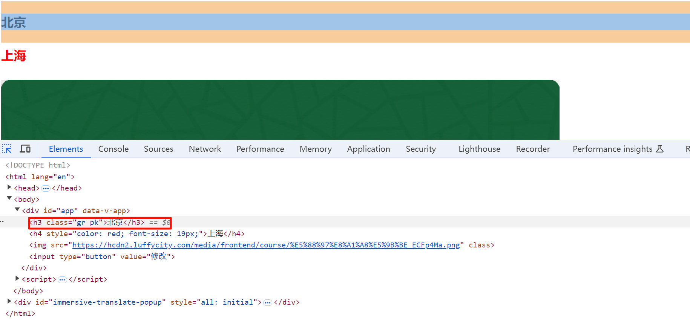

# Vue知识点

## 创建vue项目：

两种方式：

- 引入js文件(国内如果网络不好，建议使用第二种比较快)

  ```javascript
  <script src="https://unpkg.com/vue@3/dist/vue.global.js"></script>
  或
  <script src="https://cdn.bootcdn.net/ajax/libs/vue/3.3.4/vue.global.prod.js"></script>
  ```

  引入js文件后需要对相应的代码块（如一个div块）进行注册：

  ```html
  <div id="app"></div>
  
  <script>
      var app = Vue.createApp({});
  	app.mount("#app")
  </script>
  ```

  此时代表一个vue项目构建完成，但是这样显得构建项目比较麻烦，所以我们通常会使用vite来构建vue项目

- 使用项目构建工具vite(**推荐**)

  win+R-->cmd 定位到需要创建项目的盘符或文件夹
  
  指令`npm create vue@latest`
  
  
  
  其中关于Vue Router,Pinia,ESLint在后续代码开发时都会使用到，这里先暂不安装
  
  使用webstorm打开项目后，需要执行`npm install`安装项目依赖
  
  
  
  安装后执行`npm run dev`即可看到安装完成
  
  
  
  也可以通过webstorm直接使用vite创建项目：
  
  
  
  关于使用vite安装环境后的文件说明：
  
  后续进行项目部署时，只需要执行`npm run build`就可以将项目中的所有代码编译成html,js,css等文件，可直接放到服务器上
  
  

## 组合式和选项式

组合式和选项式都是vue官方提供的，但是写项目时我们更推荐选项式，这个更方便我们利用vue官方提供的组件

### 组合式

```html
<html lang="en">
<head>
    <meta charset="UTF-8">
    <title>Title</title>
    <script src="https://unpkg.com/vue@3/dist/vue.global.js"></script>
</head>
<body>

<div id="app">
    <h1>欢迎{{name}}-余额{{balance}}</h1>
    <input type="button" value="点击充值" @click="doCharge">
    <input type="button" value="双击充值" @dblclick="doCharge2">
</div>

<script>
	var app = Vue.createApp({
		data: function () {
			return {
				name: "Wilson",
				balance: 19
			}
		},
		methods: {
			doCharge: function () {
				alert("点击")
				this.name = "Wilson2"
			},
			doCharge2: function () {
				alert("双击")
				this.balance += 1000
			}
		}
	});
	app.mount("#app")
</script>

</body>
</html>
```

#### 代码规范

在使用组合式时，我们必须遵循的代码规范有：

- 所有的变量需要写在所创建app中的以data为键的字典中，其值是一个函数，函数的返回值即为我们所需要的变量：

  ```javascript
  var app = Vue.createApp({
  	data: function () {
  		return {
  			name: "Wilson",
  			balance: 19
  		}
  	},
  });
  ```

- 所有的动态操作需要写成函数，放在所创建app中的以method为键的字典中，其值是一个函数，函数内部即为我们所需要的操作，

  操作的相互绑定需要使用vue中定义好的特殊值（如`@click`单击，`@dbclick`双击等）,后面写函数名称

  当我们需要对data中所定义的变量通过method中的函数进行修改时，需要通过`this.`来找到data中所定义的变量

  ```html
  <div id="app">
      <h1>欢迎{{name}}-余额{{balance}}</h1>
      <input type="button" value="点击充值" @click="doCharge">
      <input type="button" value="双击充值" @dblclick="doCharge2">
  </div>
  
  <script>
  var app = Vue.createApp({
  	methods: {
  		doCharge: function () {
  			alert("点击")
  			this.name = "Wilson2"
  		},
  		doCharge2: function () {
  			alert("双击")
  			this.balance += 1000
  		}
  	}
  });
  </script>
  ```

### 选项式（推荐）

这里只讲述选项式和组合式的区别

```html
<html lang="en">
<head>
    <meta charset="UTF-8">
    <title>Title</title>
    <script src="https://unpkg.com/vue@3/dist/vue.global.js"></script>
</head>
<body>

<div id="app">
    <h1>欢迎{{name}}-余额{{balance}}</h1>
    <input type="button" value="点击充值" @click="doCharge">
    <input type="button" value="双击充值" @dblclick="doCharge2">
</div>

<script>
	var app = Vue.createApp({
		setup: function () {
			var name = Vue.ref("Wilson")
			var balance = Vue.ref(1000)
			var doCharge = function () {
				name.value = "Wilson999"
				balance.value = 999
			}
			var doCharge2 = function () {
				balance.value += 1000
			}
			return {name, balance, doCharge, doCharge2}
		},
	}); 
	app.mount("#app")
</script>

</body>
</html>
```

#### 代码规范

- 所有需要使用的变量和函数都需要放在以setup为键的一个函数中（不需要data和methods），所有变量名和函数名都需要返回才能在HTML中使用：

  ```js
  var app = Vue.createApp({
  	setup: function () {
  		var name = Vue.ref("Wilson")
  		var balance = Vue.ref(1000)
  		var doCharge = function () {
  			name.value = "Wilson999"
  			balance.value = 999
  		}
  		var doCharge2 = function () {
  			balance.value += 1000
  		}
  		return {name, balance, doCharge, doCharge2}
  	},
  });
  ```

- 当我们需要修改变量时，需要使用`Vue.ref`将变量包裹，可以理解为将变量变成一个对象，此变量的value值即为此变量的具体值，即修改时也需要对value值进行修改（不需要使用`this.`）

  ```js
  var app = Vue.createApp({
  	setup: function () {
  		var name = Vue.ref("Wilson")
  		var balance = Vue.ref(1000)
  		var doCharge = function () {
  			name.value = "Wilson999"
  			balance.value = 999
  		}
  		var doCharge2 = function () {
  			balance.value += 1000
  		}
  		return {name, balance, doCharge, doCharge2}
  	},
  });
  ```

#### 注意（未写完，等到vite构建时学完后再来补充）

当我们使用组合式时，每次都需要在setup中定义函数，并返回值，这样有点繁琐

vue中也提供了简便方法，我们可以将setup写在`<script>`中，这样就不需要定义函数了，所有已定义的变量会自动返回，`<script setup></script>`所包裹的内容即原来setup函数中所定义的变量和返回值，原代码可以做如下修改：

（这种方法仅使用与使用vite构建vue项目时使用）

```html
<html lang="en">
<head>
    <meta charset="UTF-8">
    <title>Title</title>
    <script src="https://unpkg.com/vue@3/dist/vue.global.js"></script>
</head>
<body>

<div id="app">
    <h1>欢迎{{name}}-余额{{balance}}</h1>
    <input type="button" value="点击充值" @click="doCharge">
    <input type="button" value="双击充值" @dblclick="doCharge2">
</div>

<script setup>
	var name = Vue.ref("Wilson")
	var balance = Vue.ref(1000)
	var doCharge = function () {
		name.value = "Wilson999"
		balance.value = 999
	}
	var doCharge2 = function () {
		balance.value += 1000
	}
</script>

</body>
</html>
```

### 拓展语法

- 函数编写

  当我们需要编写函数时，可以使用`doCharge() {}`来表示一种省略写法，这种写法等同于`doCharge: function () {}`

- 解包

  一个小案例：

  ```html
  <html lang="en">
  <head>
      <meta charset="UTF-8">
      <title>Title</title>
  </head>
  <body>
  <script>
  	var Vue = {name: "Wilson", age: 19}
  	console.log(Vue)
  	var {name, age} = Vue
  	console.log(name, age)
  </script>
  
  </body>
  </html>
  ```

  

  我们可以将需要的部分vue包从vue中提取出来，这样下面书写时就不需要添加`Vue.`

  ```html
  <script>
  	const {createApp, ref} = Vue
  	var app = createApp({
  		setup: function () {
  			var name = ref("Wilson")
  			var balance = ref(1000)
  			var doCharge = function () {
  				name.value = "Wilson999"
  				balance.value = 999
  			}
  			var doCharge2 = function () {
  				balance.value += 1000
  			}
  			return {name, balance, doCharge, doCharge2}
  		},
  	});
  	app.mount("#app")
  </script>
  ```

- 导包

  我们可以将需要的特定包从js文件或CDN中导入

  **注意**：`<script type="module">`

  ```html
  <script type="module">
  	import { createApp, ref } from 'https://unpkg.com/vue@3/dist/vue.esm-browser.js'
  	import { createApp, ref } from './js/vue.js'
  </script>
  ```


## 常量和变量（var和const)

var是指变量，const是指常量；变量可以被修改，而常量不可以被修改

（所以当我们使用时，可以统一使用var）

特别的，当我们使用const定义一个字典时，如果要把这个字典换成另一个字典，这个肯定不行，但是如果只是将字典中的某些键值对进行更改，那是可行的



## 响应式基础（只针对组合式API）

vue中，常量和变量是不支持修改的，我们需要修改，有两种方式：`ref`和`reactive`

- ref

  ```html
  <div id="app">
      <h1>欢迎{{name}}-余额{{balance}}</h1>
      <h1>{{info.city}}-{{info.size}}</h1>
      <input type="button" value="修改" @click="doChange">
  </div>
  
  <script>
  	const {createApp, ref} = Vue
  	var app = createApp({
  		setup: function () {
  			var name = ref("Wilson")
  			var balance = ref(1000)
  			var info = ref({
  				city: "北京",
  				size: 1000
  			})
  			var doChange = function () {
  				name.value = "Wilson999"
  				balance.value = 999
  				info.value.city = "广州"
  				info.value.size = 999
                  // ref还支持整体修改
  				info = {
  					city: "南京",
  					size: 666
  				}
  			}
  			return {name, balance, info, doChange}
  		},
  	});
  	app.mount("#app")
  </script>
  ```

- reactive

  使用`reactive`后，对字典里面的值进行修改时不需要`.value`

  **注意**：reactive不支持里面放字符串或整数，只支持列表，字典（里面放对象），而且无法被整体替换

  ```html
  <div id="app">
      <h1>欢迎{{name}}-余额{{balance}}</h1>
      <h1>{{info.city}}-{{info.size}}</h1>
      <input type="button" value="修改" @click="doChange">
  </div>
  
  <script>
  	const {createApp, ref, reactive} = Vue
  	var app = createApp({
  		setup: function () {
  			var name = ref("Wilson")
  			var balance = ref(1000)
  			var info = reactive({
  				city: "北京",
  				size: 1000
  			})
  			var doChange = function () {
  				name.value = "Wilson999"
  				balance.value = 999
  				info.city = "广州"
  				info.size = 999
  			}
  			return {name, balance, info, doChange}
  		},
  	});
  	app.mount("#app")
  </script>
  ```

## 插值表达式

插值表达式是vue框架提供的一种在html模板中绑定数据的方式，使用{{变量名}}方式绑定vue实例中data中的数据变量。会将绑定的数据实时的显示出来。

注意：`{{}}`括起来的区域，就是一个就是js语法区域，在里面可以写部份的 js 语法。表达式中不能定义变量或函数，也`不可以写 if 条件或循环`，分支语句、循环语句，

```html
<div id="app">
    <h1>欢迎{{name}}-余额{{balance}}</h1>
    <h1>{{info.city}}-{{info.size}}</h1>
    <input type="button" value="修改" @click="doChange">
    <hr>
    <ul>
        <li>{{"中国北京"}}</li>
        <li>{{"Wilson" + "中国北京"}}</li>
        <!--三元表达式-->
        <li>{{1 === 1 ? "Ture" : "False"}}</li>
        <li>{{balance > 500 ? "Ture" : "False"}}</li>
    </ul>
</div>
<script>
	const {createApp, ref, reactive} = Vue
	var app = createApp({
		setup: function () {
			var name = ref("Wilson")
			var balance = ref(100)
			var info = reactive({
				city: "北京",
				size: 1000
			})
			var doChange = function () {
				balance.value += 100
			}

			return {name, info, balance, doChange}
		},
	});
	app.mount("#app")
</script>
```

## v-bind指令

当我们需要更改标签中的某些属性时，普通的插值表达式就不能满足我们的需求了

例如img标签的src属性，如果我们使用普通的插值表达式，在页面上渲染出来就是一堆字符串，这时候我们就需要v-bind指令来修改**特定标签的属性**

同样，v-bind指令也支持三元表达式

**注意**：`v-bind:class="[]"`放列表，`v-bind:style="{}"`放字典

```HTML
<!DOCTYPE html>
<html lang="en">
<head>
    <meta charset="UTF-8">
    <title>Title</title>
    <style>
        .red {
            border: 5px solid red;
        }
    </style>
    <script src="https://cdn.bootcdn.net/ajax/libs/vue/3.3.4/vue.global.prod.js"></script>
</head>
<body>

<div id="app">
    <h3 v-bind:class="[green, pink]">北京</h3>
    <h4 v-bind:style="{color:'red', fontSize: '19px'}">上海</h4>
    
    <input type="button" value="修改" @click="doCharge">
</div>


<script>
	const {createApp, ref, reactive} = Vue
	var app = createApp({
		setup: function () {
			var url = ref("https://hcdn2.luffycity.com/media/frontend/course/%E5%88%97%E8%A1%A8%E5%9B%BE_ECFp4Ma.png")
			var cls = ref("")
			var green = ref("gr")
			var pink = ref("pk")
			var doCharge = function () {
				url.value = "https://hcdn2.luffycity.com/media/frontend/course/%E5%88%97%E8%A1%A8%E5%9B%BE_07YhW0A.png"
				cls.value = "red"
			}
			return {url, cls,pink, green, doCharge}
		},
	});
	app.mount("#app")
</script>

</body>
</html>
```



## v-model指令

v-model指令用于与用户交互的标签：`input`,`select`,`textarea`等

双向绑定：

- 组合式API：直接使用v-model指令
- 选项式API：v-model指令+ref/reactive

选项式：

```html
<!DOCTYPE html>
<html lang="en">
<head>
    <meta charset="UTF-8">
    <title>Title</title>
    <script src="https://cdn.bootcdn.net/ajax/libs/vue/3.3.4/vue.global.prod.js"></script>
</head>
<body>

<div id="app">
    <h3>{{city}}</h3>
    <input type="text" placeholder="请输入指令" v-model="user">
    <h4>{{user}}</h4>
</div>

<script>
	const {createApp, ref, reactive} = Vue
	var app = createApp({
		setup: function () {
                const city= ref("北京")
                const user = ref("wilson")
			return {city, user}
		},
	});
	app.mount("#app")
</script>

</body>
</html>
```

组合式：

```html
<!DOCTYPE html>
<html lang="en">
<head>
    <meta charset="UTF-8">
    <title>Title</title>
    <script src="https://cdn.bootcdn.net/ajax/libs/vue/3.3.4/vue.global.prod.js"></script>
</head>
<body>

<div id="app">
    <h3>{{city}}</h3>
    <input type="text" placeholder="请输入指令" v-model="user">
    <h4>{{user}}</h4>
</div>

<script>
	const {createApp, ref, reactive} = Vue
	var app = createApp({
		data: function () {
                return{
					user:"wilson"
                }
		},
	});
	app.mount("#app")
</script>

</body>
</html>
```

## v-for指令

v-for可用于列表循环

```html
<!DOCTYPE html>
<html lang="en">
<head>
    <meta charset="UTF-8">
    <title>Title</title>
    <script src="https://cdn.bootcdn.net/ajax/libs/vue/3.3.4/vue.global.prod.js"></script>
</head>
<body>

<div id="app">
    <div class="box">
        <ul>
            <li v-for="(item, idx) in cityList">{{idx}}-{{item}}</li>
        </ul>
    </div>
</div>

<script>
	const {createApp, ref, reactive} = Vue
	var app = createApp({
		setup: function () {
			    const cityList = ["北京", "上海" ,"深圳"]
			return {cityList}
		},
	});
	app.mount("#app")
</script>

</body>
</html>
```

## v-show指令

v-show可用于指定标签是否展示

```html
<!DOCTYPE html>
<html lang="en">
<head>
    <meta charset="UTF-8">
    <title>Title</title>
    <script src="https://cdn.bootcdn.net/ajax/libs/vue/3.3.4/vue.global.prod.js"></script>
</head>
<body>

<div id="app">
    <div>
        <button @click="show">展示</button>
    </div>
    <div v-show="isshow">
        <h1>Wilson</h1>
    </div>
</div>

<script>
	const {createApp, ref, reactive} = Vue
	var app = createApp({
		setup: function () {
            const isshow = ref(false)
            const show = function () {
                isshow.value = true
			}

			return {isshow, show}
		},
	});
	app.mount("#app")
</script>

</body>
</html>
```

## v-if指令

v-if效果与v-show指令一样

不同之处在于：

show存在与页面上，但是基于`display:none`不显示；

if根本不会在页面上存在

## v-on指令

v-on用于表示事件相关的指令，也可以简写

相关事件有：click,dbclick,mouseover,mouseover...

```html
<!DOCTYPE html>
<html lang="en">
<head>
    <meta charset="UTF-8">
    <title>Title</title>
    <script src="https://cdn.bootcdn.net/ajax/libs/vue/3.3.4/vue.global.prod.js"></script>
</head>
<body>

<div id="app">

    <h1 style="background-color:cornflowerblue;width: 300px;height: 400px " @mouseover="doSomething('进入')"
        @mouseout="doSomething('出去')">北京</h1>

</div>

<script>
	const {createApp, ref, reactive} = Vue
	var app = createApp({
		setup: function () {
			const doSomething = function (arg) {
				console.log(arg)
			}
			return {doSomething}
		},
	});
	app.mount("#app")
</script>

</body>
</html>
```

## 生命周期


官网链接[组合式 API：生命周期钩子 | Vue.js (vuejs.org)](https://cn.vuejs.org/api/composition-api-lifecycle.html#composition-api-lifecycle-hooks)


