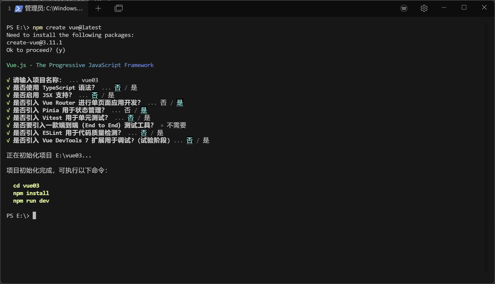

# vue-pinia组件

当我们进行项目开发的时候，会用到很多vue组件，组件之间该如何共享数据？

pinia是官方推出的用于状态管理的组件，相比于vuex更轻量级，更好用

pinia就相当于一个代理，可以在不同的组件间共享数据和信息

三个状态管理组件

- state：状态值
- getter：计算属性
- action：定义方法（函数）

## 下载

推荐使用默认安装方法，可省略手动配置信息



## 简单使用

默认的生成文件在根目录stores/counter.js

```js
import { ref, computed } from 'vue'
import { defineStore } from 'pinia'

export const useCounterStore = defineStore('counter', () => {
  const count = ref(0)
  const doubleCount = computed(() => count.value * 2)
  function increment() {
    count.value++
  }

  return { count, doubleCount, increment }
})

```

其中，count相当于state，doubleCount相当于getter，increment相当于action

当我们需要在其他vue组件中使用时，只需要导入即可：

```vue
<script setup>
import {useCounterStore} from "@/stores/counter.js";

const store = useCounterStore()
console.log(store.count)
console.log(store.doubleCount)
</script>
```

**注意**：pinia组件在页面刷新之后就会恢复初始值，所以要配合本地化结合使用（localstorage+cookie）

## 用户登录逻辑

stores/counter.js

```js
import {ref, computed} from 'vue'
import {defineStore} from 'pinia'

export const useInfoStore = defineStore('useInfoStore', () => {
	const userString = ref(localStorage.getItem("info"))
	const userDict = computed(() => userString.value ? JSON.parse(userString.value) : null)

	const userID = computed(() => userString.value ? userDict.value.id : null)
	const userName = computed(() => userString.value ? userDict.value.name : null)
	const userToken = computed(() => userString.value ? userDict.value.token : null)

	function doLogin(info) {
		// info={id:1, name:"wilson", token:"xxx"}
		// 登录成功后，用户信息写到本地存储，并同步到pinia中；当页面刷新时，pinia可以重新去localStorage中获取用户信息
		localStorage.setItem("info", JSON.stringify(info))
		userString.value = JSON.stringify(info)
	}

	function doLogout() {
		localStorage.clear()
		userString.value = null
	}

	return {userString, userID, userName, userToken, doLogin, doLogout}
})
```

LoginView.vue

```js
import {useInfoStore} from "@/stores/counter.js";
const router = useRouter()

function doLogin() {
  // 发送网络请求
  // pinia存储用户信息
  const store = useInfoStore()
  let info = {id:1, name:username.value, token:"xxx"}
  store.doLogin(info)
  // 成功后跳转
  router.push({name: "mine"})
}

function doLogout() {
  store.doLogout()
  router.push({"name": "login"})
}
```

结合导航守卫，可完整实现用户登录逻辑

router/index.js

```js
import {useInfoStore} from "@/stores/counter.js";

router.beforeEach((to, from, next) => {
  if(to.name == "login") {
    next()
    return
  }
  const store = useInfoStore()
  if (!store.userID) {
    next({name: "login"})
    return
  }
  next()
})
```

