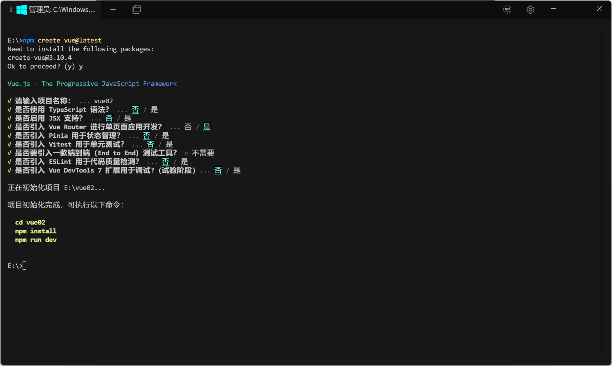
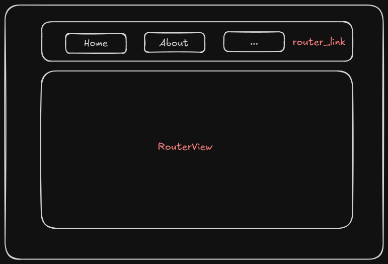
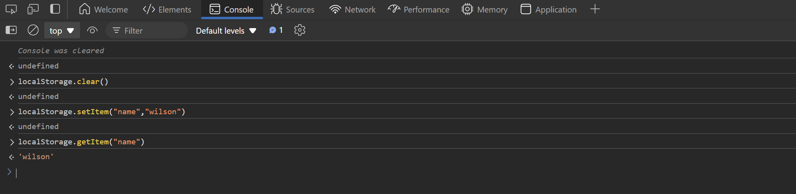

# vue-router组件

vue-router可以实现单页面应用（一个网站就一个页面）（通过加载不同的组件实现）

显示效果：点击不同的按钮，显示不同的信息

## 下载

- `npm install vue-router`+手动配置文件

- 创建项目的时候引入vue-router（自动配置文件）

  

## 使用

先来看App.vue文件：`router-link`即为导航栏，点击跳转之后的内容会展示在`RouterView`中；`router-link`具体路径即为访问路由

```vue
<script setup>
import { RouterLink, RouterView } from 'vue-router'

</script>

<template>

    <div>
      <router-link to="/">Home</router-link>
      <router-link :to="{name: 'about'}">About</router-link>
    </div>

  <RouterView />
</template>

<style scoped>

</style>
```



具体的RouterView路径在router的配置文件`index.js`中

```js
import { createRouter, createWebHistory } from 'vue-router'
const router = createRouter({
  history: createWebHistory(import.meta.env.BASE_URL),
  routes: [
    {
      path: '/',
      name: 'home',
      component: () => import('../views/HomeView.vue')
    },
    {
      path: '/about',
      name: 'about',
      component: () => import('../views/AboutView.vue')
    },
    {
      path: '/demo/:id',
      name: 'demo',
      component: () => import('../views/DemoView.vue')
    }
  ]
})

export default router
```

当我们需要在路由上携带参数时，有两种方法

```vue
<script setup>
import { RouterLink, RouterView } from 'vue-router'

</script>

<template>

    <div>
      <router-link to="/?v1=123&v2=456">Home</router-link><!--方法一-->
      <router-link :to="{name: 'about', query: {v1:123, v2:456}}">About</router-link><!--方法二-->
      <router-link :to="{name: 'demo', params: {id:1}}">About</router-link><!--方法三-->
    </div>

  <RouterView />
</template>

<style scoped>

</style>

```

当我们要接收路由上携带参数时，需要从vue-router中导入useRoute，创建对象后route.query就是路由中传递的参数

```vue
<script setup>
import {useRoute} from "vue-router";
const route = useRoute()
console.log(route.query) // 方法一方法二
console.log(route.params) // 方法三  
</script>
```

**注意:**通过路由进行跳转时，由当前组件跳转至当前组件，即使url发生变化也不会重新加载组件参数

解决方法：使用`onBeforeUpdate()`，括号里写一个函数，传2个参数：to和from（from表示从哪儿而来，to表示去哪儿）

```vue
<script setup>
import {onBeforeUpdate} from "vue";

onBeforeUpdate((to, from) => {
  console.log(to, from)
  console.log(to.query)
})

</script>
```


## 路由的嵌套

vue-router路由组件支持路由的嵌套

```js
// router/index.js
import { createRouter, createWebHistory } from 'vue-router'
const router = createRouter({
  history: createWebHistory(import.meta.env.BASE_URL),
  routes: [
    {
      path: '/',
      name: 'home',
      component: () => import('../views/HomeView.vue'),
      children: [
        {
          path: 'home1',
          name: 'home1',
          component: () => import('../views/HomeView.vue')
        },
        {
          path: 'home2',
          name: 'home2',
          component: () => import('../views/HomeView.vue')
        },
      ]
    },
  ]
})

export default route
```

以上配置的访问路由为/home/home1和/home/home2

当我们访问父路由时，是否要显示子路由呢？还是默认展示一个子路由？

这里有两种解决办法：

```js
import { createRouter, createWebHistory } from 'vue-router'
const router = createRouter({
  history: createWebHistory(import.meta.env.BASE_URL),
  routes: [
    {
      path: '/admin',
      name: 'admin',
      component: () => import('../views/AdminView.vue'),
      children: [
        {
          path: "",
          redirect: {name: 'mine'},
          // component: () => import('../views/MineView.vue')
        },
        {
          path: 'mine',
          name: 'mine',
          component: () => import('../views/MineView.vue')
        },
        {
          path: 'order',
          name: 'order',
          component: () => import('../views/OrderView.vue')
        },
      ]
    }
  ]
})

export default router
```

- `redirect: {name: 'mine'}`：当访问`/admin`时，默认展示mine页面，路由为`/admin/mine`
- `component: () => import('../views/MineView.vue')`：当访问`/admin`时，默认展示mine页面，路由为`/admin`

## userRouter(编程式导航)

如果不想使用`router_link`组件想要实现页面的跳转，还可以使用userRouter

```js
import {useRouter} from "vue-router";
const router = useRouter()
const router = useRouter()
router.push({path: "/admin/mine"})
router.push({name: "login"})
//也可以接收参数
router.push({name: "login", params: {nid: 100}, query:{page: 100}})
```

router.repalce使用方法与router.push一样
不同点：

- router.push (location) 会向 history 栈添加一个新的记录，当用户点击浏览器后退按钮时，则回到之前的 URL。

- router.replace (location) 它不会向 history 添加新记录，而是替换掉当前的 history 记录。

## 导航守卫

from:从哪里来；to:到哪里去

```js
import { createRouter, createWebHistory } from 'vue-router'
const router = createRouter({
  history: createWebHistory(import.meta.env.BASE_URL),
  routes: [
    {
      path: '/login',
      name: 'login',
      component: () => import('../views/LoginView.vue')
    },
    {
      path: '/info',
      name: 'info',
      component: () => import('../views/InfoView.vue')
    }
  ]
})
router.beforeEach(function (to, from, next){})//函数
router.beforeEach((to, from, next) => {})//函数简写
export default router
```

from:从哪里来；to:到哪里去

定义`router.beforeEach`后，在每次执行路由跳转的时候，都会执行此函数

可以在这里写用户是否登录成功的判断逻辑，以此来判断某些界面普通用户是否可以访问，是否有权限等

- 方法一：将通过验证之后的身份令牌（JWT）存入浏览器的本地存储（localStorage）

  localStorage永久保存，无有效期

  补充：调用浏览器的本地存储（localStorage）的几种方法：

  ```js
  localStorage.setItem(key, value)
  localStorage.setItem(key)
  localStorage.removeItem(key)
  localStorage.clear()
  ```

- 方法二：cookie保存，可设置有效期

  ```js
  document.cookies=...
  ```

- 方法三：sessionStorage

  使用方法与sessionStorage，但只在浏览器打开时有效，关闭浏览器后sessionStorage会清空

  

简单判断逻辑：

获取不到username，返回登录页面；登录成功，往后走next()，继续向后访问

```js
router.beforeEach((to, from, next) => {
  let username = localStorage.getItem("name")
  if(!username) {
    next({name: "login"})
    return
  }
  next()
})
```


